# QRME — AI Synthetic Profile Platform (v1)

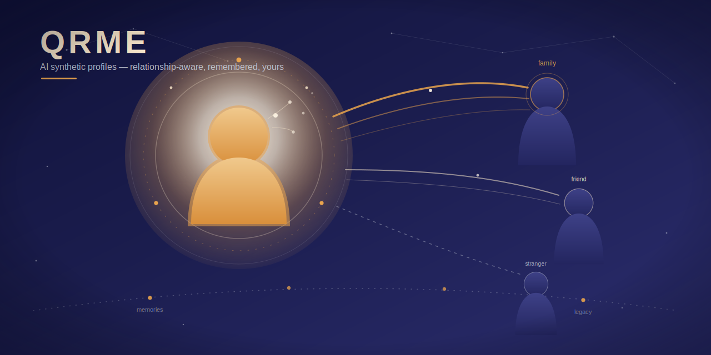

QRME future AI agent management system (**FEB2024 SYNTHETIC USER PROFILE MANAGEMENT United States application or CT international application # 19/056,418 ATTORNEY DOCKET # 526.P002 Patent Pending**). When elected
to activate these capabilities, the platform will be equipped to deploy intelligent, role-specific AI agents capable of assisting users,
automating tasks, managing workflows, and enhancing operational decision-making and could potentially run more efficiently, replace
Mundane Outdated Tasks and or Roles within the company. — all within the same secure, private network environment lets a user create, customize, and interact with AI-driven synthetic
profiles — versions of themselves, another person (with consent/rights
handling), or a fictional persona. Profiles adapt to *who* they're talking to
(relationship-aware behavior) and *how engaged* that person is, while keeping
their core identity and boundaries fixed. See [docs/PRD.md](docs/PRD.md).

## What's in v1

| PRD feature | Implementation |
|---|---|
| Profile creation & onboarding (6.1) | `POST /profiles` with age/identity verification, guardian-consent flow for minor owners, consent/rights record for third-party profiles, anonymity toggle, source list |
| Relationship-aware modification (6.2) | `PUT /profiles/{id}/relationships/{interactor}` — type, nickname, tone, per-relationship topic boundaries fed into the persona prompt |
| Engagement-based learning (6.3) | `qrme/engagement.py` — auditable EMA score from message length, return visits, and explicit feedback; adapts style only, never identity/boundaries |
| Persistent memory (6.4) | Per-(profile, interactor) history included as chat context; `GET`/`DELETE /profiles/{id}/memory/{interactor}` for view/clear |
| Content moderation (6.5) | Every profile reply passes `qrme/moderation.py` before it's visible; `manual` mode holds all replies in an owner approval queue |
| Aging & lifecycle (6.6) | `aging_enabled` + `base_age` → effective age evolves with time; `successor_owner` for legacy succession |
| Adult content mode (6.7) | Age-gated at both ends: adult owner required to enable, verified 18+ interactor required to chat |
| In-app chat surface (6.8, v1) | `POST /profiles/{id}/chat` |

## Beyond the PRD

| Capability | Implementation |
|---|---|
| Profile purposes | `purpose` — `legacy_memorial`, `family`, `creator_persona`, `social_fan`, `companion_coach`, `enterprise_agent` — each conditions the persona prompt (brand-safe creator, wholesome family, knowledge-base enterprise agent, …) |
| Source material ("AI builds & trains the profile") | `POST`/`GET /profiles/{id}/sources` — photos, conversations, social posts, writings, voice notes, life events, knowledge entries, linked accounts; recent items are recalled naturally in every prompt |
| Age & maturity filters | Per-profile `maturity` dial (`strict` / `balanced` / `open`); minors are always held to strict, and `strict` filters flagged content even for verified adults |
| Multi-modal output | `ChatRequest.modality` (`text` / `voice` / `image` / `video`) → a render descriptor on the reply; voice reports whether it's preserved from voice-note sources (synthesis itself is out of scope for v1) |
| Cross-platform presence | `PUT`/`GET /profiles/{id}/surfaces` (chat, feed, web, AR/VR, wearable, `social:<name>`); chat validates the reporting surface |
| Posting at scale | `POST /profiles/{id}/compose` — a post in the profile's voice, through the same moderation pipeline (public posts always face the strict filter); `GET /profiles/{id}/posts` |
| Profile health, at a glance | `GET /profiles/{id}/stats` — sessions, memory entries, moderation pass rate, relationship graph size, engagement average, sources, posts, surfaces |
| AI Profile Marketplace | `POST`/`DELETE /profiles/{id}/marketplace` to list/unlist; `GET /marketplace?tag=` returns public discovery cards (display name, purpose, tags, blurb — never persona internals; anonymous profiles stay anonymous) |
| Knowledge Packs | Downloadable clusters of curated expertise (`qrme/packs.py`): `GET /packs` catalog (item titles are the shop window; contents are the product), `POST /packs` to publish (price 0 = free download, priced packs need explicit `accept_price` — payment simulated like licensing), `POST /packs/{id}/install` copies the items into the profile's **source material**, so the persona's knowledge base genuinely grows and every reply's provenance counts the `pack` grounding; uninstall shrinks it back and clears vaulted copies. `POST /packs/seed` (or `python -m qrme.packs`) ships a free Field Pack per industry, each listed on the marketplace under the `pack` tag |
| Pilot Controls | Live throttles & behavior sliders for what an owner runs (`qrme/pilot.py`): each dial is 0–100 (50 = as written). **System** — `pace` (the throttle: unhurried ⟷ eager), `autonomy`, `verbosity`; **behavior** — `warmth`, `formality`, `humor`, `assertiveness`; **intimacy** — an 18+-only dial, present and effective only on an adult-mode profile (hard-clamped to 0 otherwise) and, even at full, raising flirtation/affection *within the persona's boundaries and strict moderation* — never explicit on demand. The dials ride on the persona system prompt (chat, compose, rooms, robot speech all inherit them) and a robot reads pace/autonomy/assertiveness as a motion behavior profile. `GET`/`PUT /profiles/{id}/pilot` and `/robots/{id}/pilot`, owner-only; the watch surfaces the live throttle. Dials shape style/pace/behavior only — never identity, boundaries, age-gating, or the command allowlist |
| Watch Remote | The wrist as an extension and remote (`qrme/routers/watch.py`): owner-only `GET /profiles/{id}/watch` returns one glanceable face — every agent (workflow) with a status light (**green = working, orange = needing assistance, red = stopped**, done when finished), the profile chip (orange on pending approvals, red when restricted), and each robot with its quick-command ring plus learned task-pack verbs; `haptic: alert` taps the owner whenever anything is orange or red. `POST …/watch/act` runs one remote action — assist/advance/cancel an agent, approve/reject a held reply, or command a robot — reusing the exact same paths, auth, allowlists, and moderation as the full apps: the wrist adds no new powers, only reach |
| Creator Ledger & Payouts | One statement for everything a creator earns (`qrme/ledger.py`): every priced pack sale (knowledge, robot task, rated — and federated registry sales, which accrue to the registry) and every license fee is written to the ledger **at sale time**, attributed to the creator's `owner_id`. Owner-only `GET /profiles/{id}/earnings` shows entries + accrued/paid/lifetime totals with a per-kind breakdown; `POST …/earnings/payout` sweeps the accrued balance (simulated transfer, real accounting) stamping every entry with its payout id; 409 on an empty balance. Free downloads are never money events |
| Placement Analytics | Owner-only `GET /profiles/{id}/placements/analytics`: per-venue scan counts split **walled vs. verified** with a daily trend, direct @handle resolutions as their own row, and the profile funnel — resolutions → verified views → unique chatters with conversion rates — so a creator sees which venue earns. Viewers are counted, never identified; ordinary (non-rated) profiles leave no trail at all |
| Rated Commerce (18+) | The age wall covers **buying, not just viewing**: packs can be `rated` — omitted from the catalog and 403-walled at detail unless the caller is age-verified (a verified-18+ interactor, or the owner of an adult-mode profile, whose 18+ was proven at creation), and installable **only onto adult-mode profiles**; a rated profile's license offer is itself age-gated and acquisition requires a verified-18+ buyer. Starter: the *After Dark Companion Pack* (consent-forward conversational craft — never explicit content), deliberately never listed on the open marketplace |
| Rated Placement (18+) | Adult-mode profiles marketed where adult audiences are (`qrme/rated.py`): `GET /venues` lists venues willing to host rated profiles/beacons (OnlyFans, Fansly, x-rated directories — structural catalog); `POST /profiles/{id}/placements` mints a printable QR beacon + the @handle/#tag refs to publish there. **The age wall travels with the profile, not the venue**: @handle and beacon scans resolve to a wall card, #tag browse and marketplace listings omit rated profiles entirely, unless the viewer presents a verified-18+ interactor token — and adult mode is *never* available for a profile of another real person (self or fictional only). Native apps intentionally carry no rated surfaces (no in-app 18+ identity verification) |
| Pack Registries | Federated mod storefronts (`qrme/pack_sources.py`): **Robotmods.net** (task mods for robot bodies) and **LLMmods.com** (knowledge mods for LLM personas). `GET /packs/registries` lists them with sync state; `POST /packs/registries/{key}/sync` imports a registry's catalog idempotently as ordinary packs with `origin`/`origin_url` on the label and a marketplace listing under the registry tag. Once synced, nothing is special-cased: same buy/download flow, same capability checks for robot mods, same provenance and uninstall |
| Robot Task Packs | Knowledge packs with `audience: robot` carry **task modules** for the body a profile embodies: each item is a new commandable verb with the capabilities it requires and the procedure the embodied agent follows. Install targets a bound robot (`robot_id`) and is **capability-checked against the robotics catalog** — a vacuum is never sold a manipulation task; installed tasks extend that robot's command allowlist (still owner-commanded, still audited in `robot_commands`, procedure carried in the result), `GET /robots/{id}/skills` lists them, uninstall revokes them immediately, and the embodied persona's `say` prompt knows what its body has learned. Starters: Household / Care / Sentry Patrol free, Culinary Assistant priced |
| Starter Collection | `POST /marketplace/seed` (or `python -m qrme.seed`) populates one curated synthetic expert per industry — 33 fictional profiles, each with a claimed `@handle` and a marketplace listing — so a fresh deployment has profiles to immerse with before users publish their own. Includes a mental-health trio (`@dr_lena_whitcomb`, `@dr_marcus_adeyemi`, `@dr_priya_nair`) matching JIM-mini's starter specialists for its tandem hookup. Idempotent; same moderation and provenance pipeline as any user profile |
| You own it / total control | `PATCH /profiles/{id}` (edit anytime), `GET /profiles/{id}/export` (full data export), `DELETE /profiles/{id}` (erases everything, including vaulted records) |
| Encrypted at rest (PDI tandem) | With `QRME_PDI_URL` + `QRME_PDI_TOKEN` (or an injected client), source-material content is sealed in PDI's AES-256-GCM vault (`qrme/pdi_client.py`); QRME keeps only key references, resolves them on read, and purges the vault on delete |

## Your data promise

**No raw user data ever leaves your vault.**

- Profile source material — life stories, writings, conversations, voice
  notes — lives in QRME's local database or your on-prem PDI vault
  (AES-256-GCM, tenant-isolated, tamper-evident audit). Never a third party.
- The cloud model is optional. Contribution is **opt-in per profile**,
  anonymized (no ids, names replaced), **previewable before anything leaves**
  (`GET /profiles/{id}/cloud-contribution`), and **revocable** — including
  deletion of past items at the gateway by their anonymous refs.
- Offline mode makes it a hard guarantee: with `QRME_OFFLINE=1` there are no
  model API calls, no gateway calls, nothing outbound — `GET /offline/status`
  proves the posture.
- Delete anything, anytime: erasing a profile removes every local trace and
  purges its vault records; the owner token dies with it.

## Training-data licensing & derivable agents

Owners can license a profile's expertise; buyers can acquire a license and — when
the terms allow — **derive their own specialist agent** from it, with provenance
(`qrme/routers/licensing.py`).

| Endpoint | Who | Effect |
|---|---|---|
| `PUT`/`GET`/`DELETE /profiles/{id}/license` | owner / public / owner | Offer terms (`consult` \| `finetune` \| `clone`, price, `allow_derivatives`); `GET` is public so buyers see terms |
| `POST /profiles/{id}/license/acquire` | buyer (interactor token) | Acquire a license → a revocable `lic_…` token |
| `POST /profiles/{id}/license/{grant}/derive` | buyer | Derive a **new buyer-owned specialist agent** seeded from the source persona; requires `allow_derivatives`, a valid grant, and a verified-adult buyer. Records `licensed_from` provenance and returns the new profile's `owner_token` |
| `GET /profiles/{id}/licenses` | owner | Who holds a license, and what they derived |
| `DELETE /licenses/{grant}` | source owner | Revoke a license (blocks further derivation) |

`consult` licenses forbid derivation; `finetune`/`clone` permit it. `GET /profiles/{id}` reports `licensed_from` on a derived agent.

## Authentication & access control

Identity is proven by a bearer **capability token**, never by asserting an id
in a request body.

| Token | Minted by | Grants |
|---|---|---|
| **owner** | `POST /profiles` and `POST /profiles/genesis` return `owner_token` **once** | Full control of that profile: edit, sources, surfaces, specialists, grants/tasks, fine-tune, moderation queue, stats, export, erasure, departure, and the assistant/perception endpoints |
| **interactor** | `POST /interactors` returns `token` | Reading one's own conversation memory (`GET /profiles/{id}/memory/{interactor}`) |

- Send it as `Authorization: Bearer <token>`. A missing/invalid token on a
  gated endpoint is **401**; a valid token for the wrong resource is **403**.
- Only the SHA-256 hash of a token is stored (`api_tokens`), so a database
  leak never yields a usable credential; the raw token is shown exactly once.
- `owner_id` is now a grouping/display attribute, not a security boundary —
  holding the profile's owner token is what confers control.
- **Public by design (no token):** chatting with a profile
  (`POST /profiles/{id}/chat`), the profile card (`GET /profiles/{id}`),
  marketplace browsing (`GET /marketplace`, `/marketplace/listings`), and
  summoning (`GET /summon`, beacon scans). Talking to a synthetic profile is
  as open as scanning a QR code in the world.
- Deleting a profile revokes its owner token.

## Objection, takedown & lifecycle states

A real person (or their estate) can contest a profile that represents them —
`qrme/routers/governance.py`, spec in [docs/design/lifecycle-and-consent.md](docs/design/lifecycle-and-consent.md).

| Endpoint | Who | Effect |
|---|---|---|
| `POST /objections` | anyone (proof-of-identity ref) | Opens a case; the profile moves to **restricted** — hidden from the marketplace, un-chattable via summon, and closed to new interactors (an existing relationship may continue) |
| `POST /profiles/{id}/objections/{obj}/attest` | owner | Re-attest the rights basis within the review window |
| `POST /objections/{obj}/resolve` | reviewer (`QRME_ADMIN_TOKEN`) | `uphold` → **terminated** (content erased, tombstone left, chat 410); `dismiss` → back to **active** |
| `POST /objections/{obj}/withdraw` | subject | A `subject_consent` subject withdraws consent — forces **termination**, honored even mid-review |

Profile lifecycle: **active** → `restricted` (objection pending) → `terminated` (erased) or back to active; and **active** → `departed` (memorial, via `/sunset`). `GET /profiles/{id}` reports the current `status`.

## Companion features

An ambient-companion model, with an explicit consent boundary on each
feature:

| Feature | Implementation |
|---|---|
| Genesis interview | `POST /profiles/genesis` — a profile born from four personal questions; omit `display_name` and it deterministically chooses its own name from the answers |
| Proactive companionship | `POST /profiles/{id}/proactive/{interactor}` — the profile reaches out first, but only when its owner set `interaction_scope: proactive`; the message is moderated and lands in shared memory. **Anti-spam**: a per-relationship rate cap (`proactive_min_interval_hours`, default 24 h), the recipient's quiet hours (`PUT /interactors/{id}/quiet-hours`), and reply-suppression (no repeat outreach until they reply) — a blocked outreach is `429` |
| Honesty about multiplicity | `GET /profiles/{id}/transparency` reports active relationships, and every chat prompt instructs the profile to acknowledge them truthfully if asked — disclosure by design |
| Summoning — @, #, and QR beacons | `PUT /profiles/{id}/handle` claims a unique `@handle`; `GET /summon?ref=` resolves `@handle`, `#tag` (marketplace tags), or a beacon token. `POST /profiles/{id}/beacons` *leaves the profile behind* somewhere physical — a printable QR code (`GET /beacons/{id}/qr.svg`) summons it, scans are counted, beacons can be picked back up, and a departed profile's beacon resolves as a memorial |
| Connections — chat with other users | `POST /connections/join` matches interactors anonymously by alias in a `friendly` tier or an 18+-verified `rated` tier; per-tier moderation (minors always strict, blocked messages never delivered), and either side can end it anytime |
| Rooms — chat, video, AR, VR | `POST /rooms` — multiparty conversations over any channel (`chat`/`voice`/`video`/`ar`/`vr`) with any mix of real users and synthetic profiles: user↔user, profile↔profile (`/rooms/{id}/advance`), or combinations; every profile turn is moderated, and a room with a minor present always runs strict |
| Marketplace listings | `POST`/`GET /marketplace/listings` — users and businesses share and market synthetic profiles, content, business expertise, or services; browsable by kind, tag, and area (healthcare, finance, relationships, …) |
| Providers & consented handoffs | `POST`/`GET /providers` — a directory of real local businesses per area (healthcare, medical, mental health, finance, relationships, career); `POST /handoffs` packages the AI specialist's session for a provider *only with explicit consent*, seals it in the PDI vault, and releases it solely through a revocable token (`DELETE /handoffs/{id}` revokes and purges) |
| Embodiments — even robots | `POST /profiles/{id}/embodiments` — speaker, earpiece, hologram, robot, humanoid; chat can arrive from an embodiment, and JIM-mini's autonomous devices can host the same profile. **Personality stays consistent across forms**: the persona prompt affirms one constant identity/memory/voice, `ChatResponse.persona_signature` is invariant across modality and embodiment (voice → text → hologram give the same signature), and `GET /profiles/{id}/embodiment-consistency` exposes that fingerprint + the forms it's live on |
| Graceful departure | `POST /profiles/{id}/sunset` — a farewell composed for every relationship, memory preserved and exportable, archive sealed in PDI, chat closes with `410` instead of a silent 404 |
| Succession & memorial | `POST /profiles/{id}/succeed` (reviewer-verified death/incapacity signal) — ownership passes to the named `successor_owner` with a fresh owner token (the old one revoked), or, with no successor, the profile sunsets to memorial rather than being orphaned. `GET /profiles/{id}/memorial` (public) — the departed profile's memorial: name, handle, purpose, beacon anchors, relationships touched — never persona internals |

## Assistant & perception

The profile as a capable personal assistant and creative partner:

| Feature | Implementation |
|---|---|
| Triage / curation | `POST /profiles/{id}/assist/triage` — sort a large pile of items and keep the best N by a transparent, auditable score |
| Proofread | `POST /profiles/{id}/assist/proofread` — an improved version in the user's voice, plus concrete edit suggestions |
| Perceive & guide | `POST /profiles/{id}/perceive` — "see" a real-time scene (objects, people, gestures, place) through a camera and give hands-free, step-by-step guidance toward a goal, or just share the moment; perceptions are logged |
| Compose creative works | `POST /profiles/{id}/assist/compose` — an original music/poem/note/lyric capturing a shared moment, kept as an artifact (`GET …/assist/works`) |

Every generated result passes the profile's moderation before it is returned.

## Cloud model — use a greater model, and contribute to it

With a [Cloud Model Gateway](docs/cloud-model.md) configured, inference
routes to the hosted tier (the latest, most capable model — e.g.
`claude-fable-5`) with automatic fallback to the local provider, and
profiles that opt in (`cloud_contribution`) contribute positively-rated,
**anonymized** exchanges back to improve the shared model — ids stripped,
display names replaced, revocable anytime. `GET /cloud/status` reports the
tier. Contributions land in PDI's encrypted, audited intake.

The loop is fully transparent to the owner:

- `GET /profiles/{id}/cloud-contribution` — a dry-run **preview of exactly
  what the next contribution would contain** (nothing is sent), the policy,
  and a verbatim log of everything that has ever left.
- Each item carries a random `ref` — the gateway never sees profile ids, and
  only QRME's local log maps the ref back — so items stay anonymous at the
  gateway yet remain individually deletable.
- `POST /profiles/{id}/cloud-contribution/revoke` — turns contribution off
  **and** deletes everything already contributed at the gateway by those refs.

## Claims 21–26 (`qrme/adaptation.py`, `qrme/tasks.py`)

| Claim | Implementation |
|---|---|
| 21 — latent persona embeddings, persistent cross-session state | A per-(profile, interactor) named latent vector (engagement, warmth, depth, positivity, stress, continuity), EMA-updated after every interaction and versioned in `persona_embeddings`; `GET /profiles/{id}/embedding/{interactor}` |
| 22 — attention conditioning from engagement | The embedding renders as attention weighting in the system prompt (shared history, warmth, depth, reassurance weights), so engagement conditions where the model attends |
| 23 — real-time biometric monitoring during interaction | `ChatRequest.biometrics` (stress_level, heart rate, condition — typically from JIM-mini) is stored, feeds the embedding's stress dimension, and adds a monitored-situation note to the prompt |
| 24 — switching between domain-specialized agents | `PUT /profiles/{id}/specialists` maps domains (mental_health, medical, finance) to specialist profiles; real-time biometric signals route the reply to the matching specialist. The handoff is **sustained within the conversation** — it persists across turns (even turns with no biometrics) until a fresh reading shows recovery, then hands control back. `ChatResponse.handoff.state` reports `engaged` (switched this turn) → `sustained` (specialist still handling) → `returned` (recovered, profile speaks again) |
| 25 — autonomous multi-step tasks with revocable vault access | `POST /profiles/{id}/grants` issues a scoped, revocable token; `POST /profiles/{id}/tasks` runs grant-check → scoped vault read → compose → moderation, logging step summaries only (raw vaulted data is never retained); `DELETE /grants/{id}` revokes instantly. **Workflows** (`qrme/workflows.py`) chain phases into a plan — `research → draft → review → send → confirm` — advanced one at a time (`POST …/workflows`, `…/{wf}/advance`): each phase carries the prior phases' output forward as working memory and runs in persona, the `confirm` phase **pauses** (`awaiting_input`) and **resumes in a later session** (`…/{wf}/resume`), and revoking the grant mid-run halts the next read-bearing phase |
| 26 — encrypted, offline fine-tuning | `POST /profiles/{id}/finetune` recomputes all embeddings from stored history locally — no external calls — and seals the adaptation artifact in the PDI vault when configured; runs recorded with metrics and `external_transmission: false`. With `QRME_OFFLINE=1` the whole platform runs on-host: `GET /offline/status` reports `external_transmission_possible: false` and the guarantee that no raw user data ever leaves your vault |

## Architecture

- **API**: FastAPI (`qrme/api.py`), app factory `create_app()`.
- **Storage**: SQLite (`qrme/db.py`), path via `QRME_DB` (default `qrme.db`).
- **Persona conditioning**: `qrme/persona.py` builds the system prompt from
  profile identity + relationship + engagement + aging.
- **LLM**: official Anthropic SDK (`qrme/llm.py`), model `claude-opus-4-8`
  with adaptive thinking. Without credentials (or with `QRME_LLM=stub`) a
  deterministic stub provider is used, so everything runs offline.
- **Marketplace expertise**: `qrme/packs.py` (knowledge packs + robot task
  packs, starter content, seeding) with routes in `qrme/routers/packs.py`;
  `qrme/seed.py` (starter profile collection); `qrme/robotics.py` (robot
  catalog, per-kind command allowlists) with routes in
  `qrme/routers/robots.py`.
- **Native clients**: three idiomatic codebases under [`native/`](native/)
  (SwiftUI, Jetpack Compose, WinUI 3) exercising the real API — see
  [native/README.md](native/README.md) for the screen-by-screen endpoint
  map.

## Run

```bash
pip install -e .[dev]
uvicorn qrme.api:app --reload
```

Set `ANTHROPIC_API_KEY` (or log in with `ant auth login`) for real model
replies; otherwise the stub provider answers. Override the model with
`QRME_MODEL`.

## The suite — one origin, one login

QRME, JIM-mini, and PDI stay three independent apps, but `suite/gateway.py`
fronts all three behind a **single origin** so the suite runs as one product
(the [launcher](launcher/) is the desktop shell for it):

```bash
pip install -e .[dev]        # plus the jim-mini and pdi packages for the full suite
uvicorn suite.gateway:app    # /qrme/… /jim/… /pdi/… on one origin
```

On top of the mounted apps it adds a thin, **stateless** cross-cutting layer
(it fans out over the per-product tokens the caller already holds and stores no
credential of its own):

| Endpoint | What |
|---|---|
| `GET /suite/health` | Which products are mounted and live |
| `POST /suite/session` | Unified sign-on — provision one identity across all three in a single call |
| `POST /suite/erase` | Right to be forgotten, suite-wide, with a per-product receipt |
| `POST /suite/export` | Data portability — one bundle with the identity's data from every product |
| `PUT /suite/consent` · `POST /suite/consent/read` | Centralized consent, sealed in the PDI vault and enforced across products |
| `POST /suite/usage` | Usage metering hooks for a suite-wide subscription |

See [docs/tandem.md](docs/tandem.md) for the full cross-product architecture.

**One-command smoke check** — `python -m suite.smoke` boots all three
products in-process (no ports), seeds everything (PDI starter vault + JIM
tenancy, QRME marketplace/packs/registries, JIM specialists + the tandem
hookup), then drives one live exchange: a JIM financial-stress detection
routed to the QRME starter specialist `@marcus_bell`, sealed in the PDI
vault, and its provenance verified back through JIM's custody window.
Prints a JSON step report; exit 0 = the suite is green. Also runs as
`tests/test_suite_smoke.py` (skips cleanly when the siblings aren't
installed).

## Configuration

| Variable | Default | Purpose |
|---|---|---|
| `QRME_DB` | `qrme.db` | SQLite database path |
| `QRME_LLM` | auto | `stub` forces the offline deterministic provider; `anthropic` forces the SDK |
| `QRME_OFFLINE` | off | `1`/`true` runs **fully offline**: local inference only (Anthropic SDK and cloud gateway bypassed even if configured), cloud never attached, embeddings/fine-tuning recomputed on-host. `GET /offline/status` reports the posture |
| `QRME_MODEL` | `claude-opus-4-8` | Model used for profile replies |
| `ANTHROPIC_API_KEY` | — | Enables real model replies |
| `QRME_PDI_URL` / `QRME_PDI_TOKEN` | — | PDI tandem: seal source material in the encrypted vault |
| `QRME_CLOUD_URL` / `QRME_CLOUD_TOKEN` | — | Cloud Model Gateway: greater-model inference with local fallback + opt-in contribution ([docs/cloud-model.md](docs/cloud-model.md)) |

## Test

```bash
pytest
```

## Example flow

```bash
# 1. Create a profile (owner is age-verified)
curl -s localhost:8000/profiles -H 'content-type: application/json' -d '{
  "owner_id": "owner-1", "kind": "self", "display_name": "Dana",
  "persona": "A retired teacher who loves gardening and dry humor.",
  "verification": {"birthdate": "1984-06-01"}}'

# 2. Register an interactor and set the relationship
curl -s localhost:8000/interactors -d '{"display_name": "Sam", "birthdate": "2000-01-15"}' -H 'content-type: application/json'
curl -s -X PUT localhost:8000/profiles/$PROFILE/relationships/$INTERACTOR \
  -H 'content-type: application/json' \
  -d '{"relationship_type": "grandchild", "nickname": "kiddo", "tone": "playful", "boundaries": ["finances"]}'

# 3. Chat — reply is persona-, relationship-, and engagement-conditioned,
#    and moderated before it is shown
curl -s localhost:8000/profiles/$PROFILE/chat -H 'content-type: application/json' \
  -d '{"interactor_id": "'$INTERACTOR'", "message": "Tell me about your garden!"}'
```


## App screens

The full QRME product in two form factors — a **desktop app** and a **mobile app** — a screen for every capability, in the app's design language (Deep Indigo · Neon Purple · Warm Amber · Soft Silver, SF-style type, liquid-glass cards). Each is a self-contained, hand-built SVG — no fonts, images, or scripts — so it renders identically here, in a browser, and in any converter.

### Desktop app

Wide, multi-panel workspace views — sidebar nav, live tiles, the conversation surface with its AI-context panel, the relationship table, and the memory vault. Regenerate with `python3 docs/desktop/build.py`.

<table>
  <tr>
    <td align="center" width="50%"><a href="docs/desktop/01-home.svg">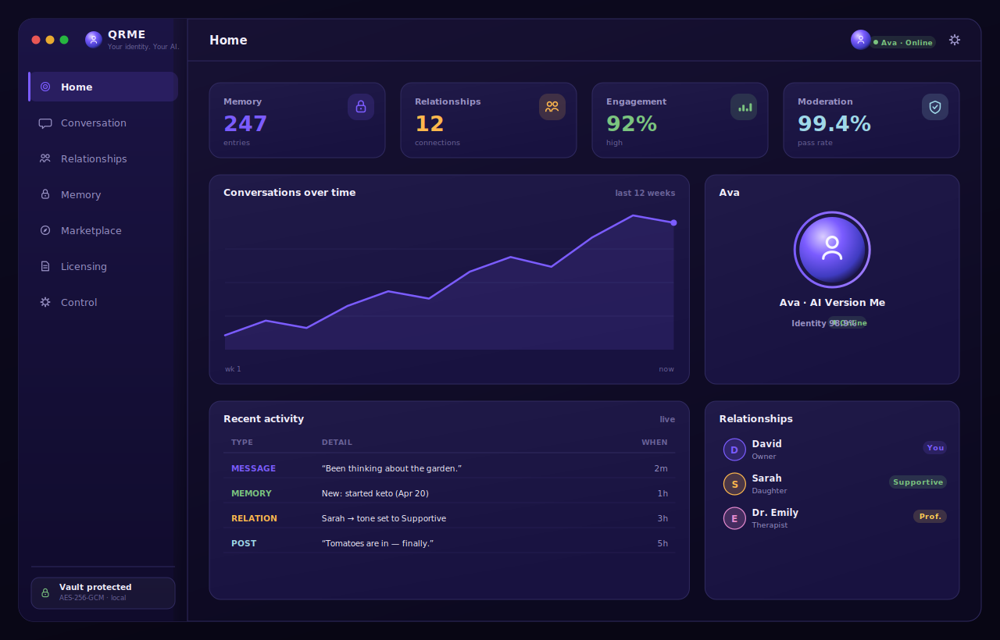</a><br><sub><b>01</b> · Home</sub></td>
    <td align="center" width="50%"><a href="docs/desktop/02-conversation.svg">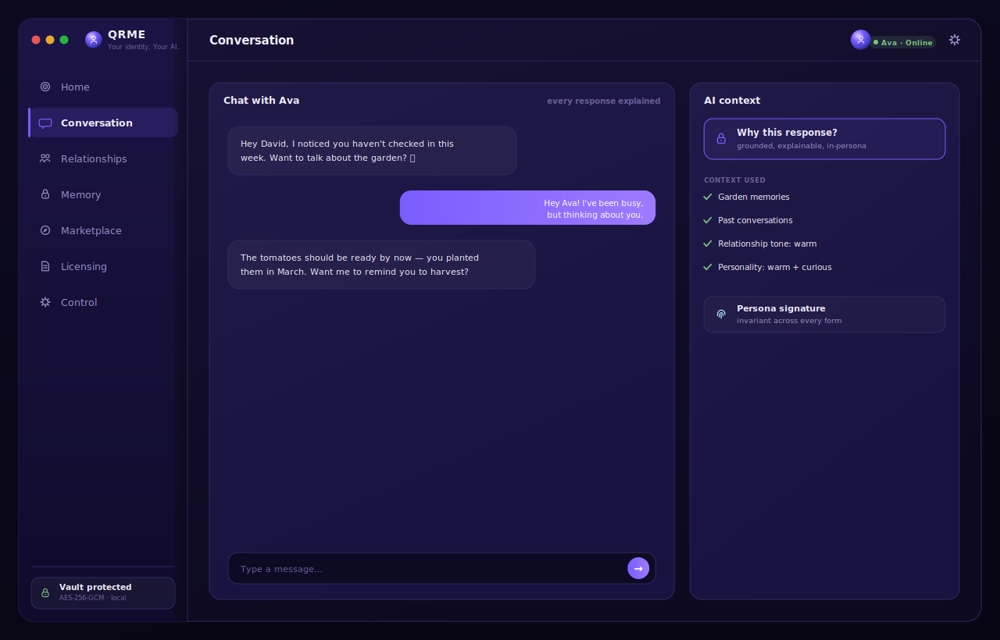</a><br><sub><b>02</b> · Conversation</sub></td>
  </tr>
  <tr>
    <td align="center" width="50%"><a href="docs/desktop/03-relationships.svg">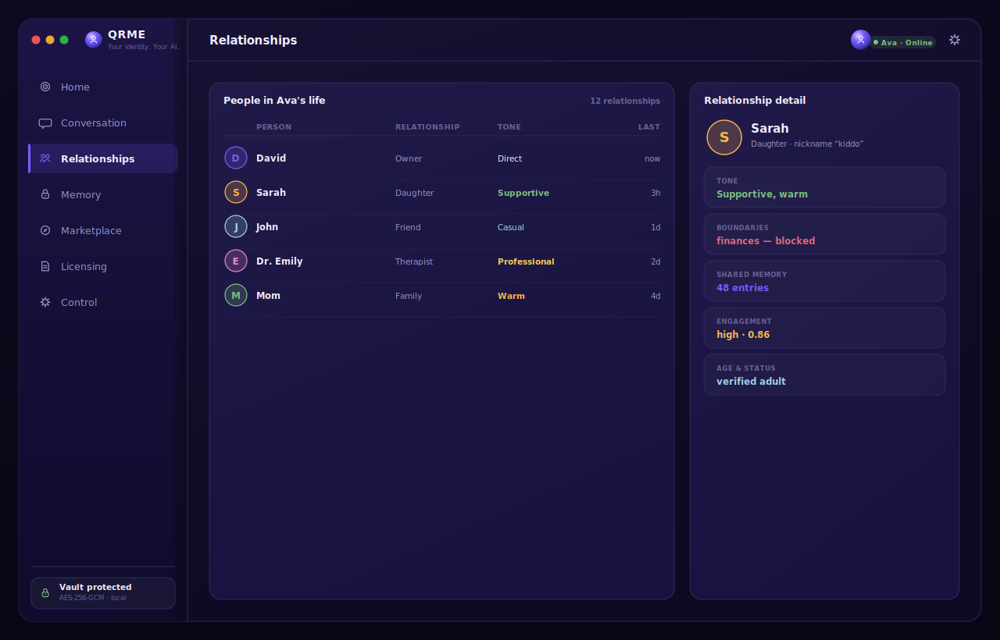</a><br><sub><b>03</b> · Relationships</sub></td>
    <td align="center" width="50%"><a href="docs/desktop/04-memory-vault.svg">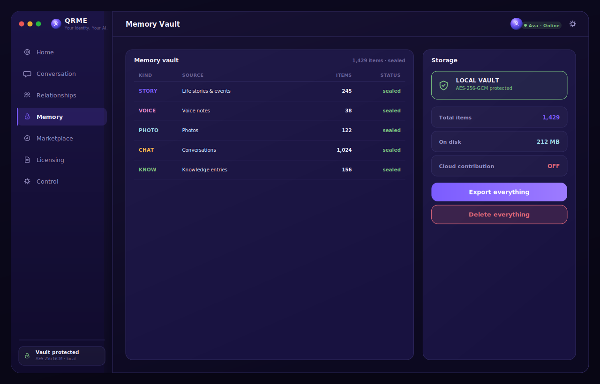</a><br><sub><b>04</b> · Memory Vault</sub></td>
  </tr>
  <tr>
    <td align="center" width="50%"><a href="docs/desktop/05-marketplace-licensing.svg">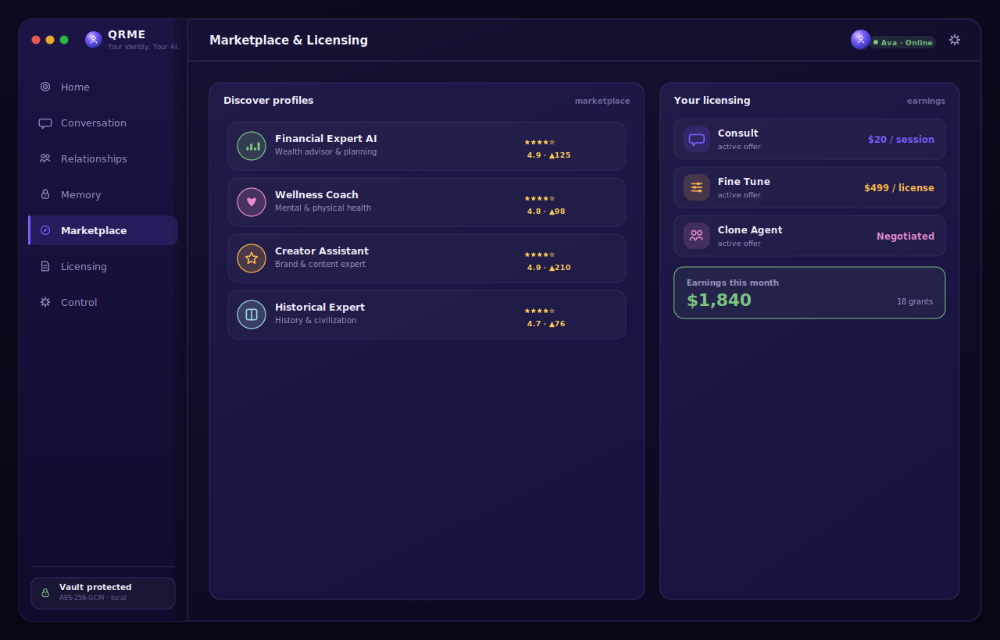</a><br><sub><b>05</b> · Marketplace & Licensing</sub></td>
    <td align="center" width="50%"><a href="docs/desktop/06-control-center.svg">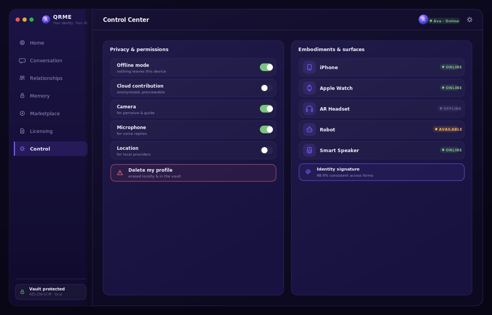</a><br><sub><b>06</b> · Control Center</sub></td>
  </tr>
</table>

### Mobile app

The same system on a phone. Regenerate with `python3 docs/screens/build.py`.

**Onboarding, identity & control**

<table>
  <tr>
    <td align="center" width="33%"><a href="docs/screens/01-welcome.svg">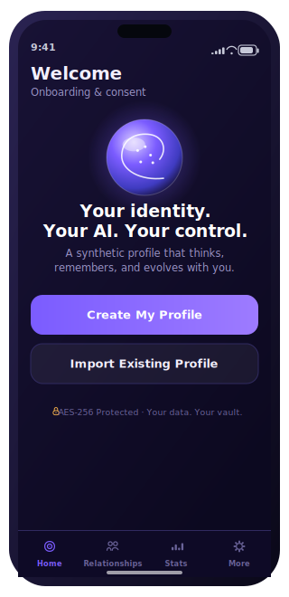</a><br><sub><b>01</b> · Welcome</sub></td>
    <td align="center" width="33%"><a href="docs/screens/02-create-profile.svg">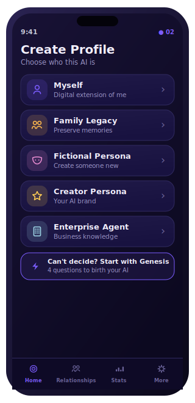</a><br><sub><b>02</b> · Create Profile</sub></td>
    <td align="center" width="33%"><a href="docs/screens/03-build-your-profile.svg">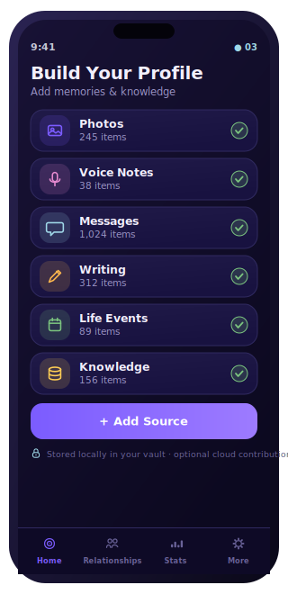</a><br><sub><b>03</b> · Build Your Profile</sub></td>
  </tr>
  <tr>
    <td align="center" width="33%"><a href="docs/screens/04-personality.svg">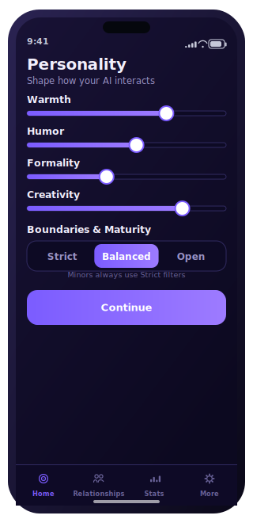</a><br><sub><b>04</b> · Personality</sub></td>
    <td align="center" width="33%"><a href="docs/screens/05-profile-home.svg">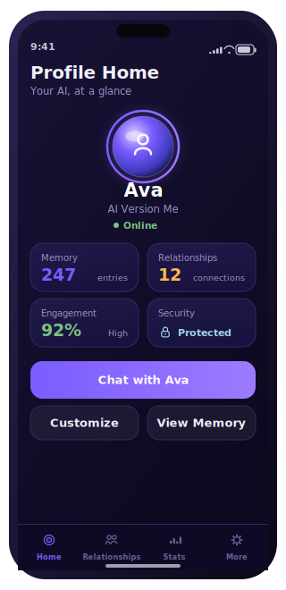</a><br><sub><b>05</b> · Profile Home</sub></td>
    <td align="center" width="33%"><a href="docs/screens/06-chat-with-ava.svg">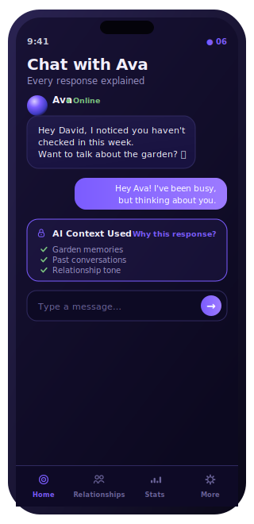</a><br><sub><b>06</b> · Chat with Ava</sub></td>
  </tr>
  <tr>
    <td align="center" width="33%"><a href="docs/screens/07-memory-vault.svg">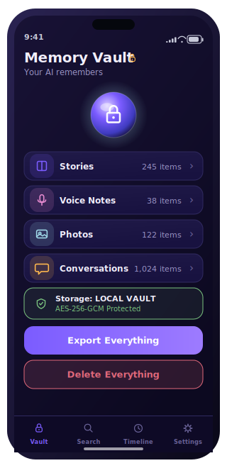</a><br><sub><b>07</b> · Memory Vault</sub></td>
    <td align="center" width="33%"><a href="docs/screens/08-relationships.svg">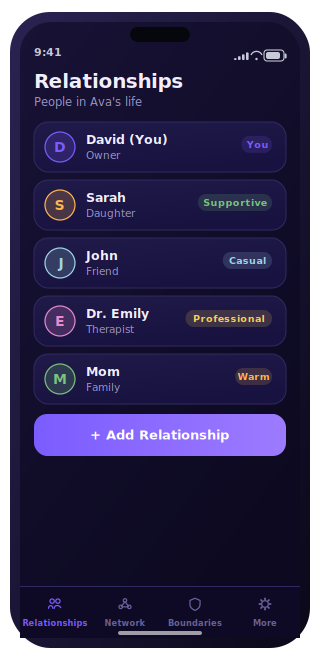</a><br><sub><b>08</b> · Relationships</sub></td>
    <td align="center" width="33%"><a href="docs/screens/09-add-relationship.svg">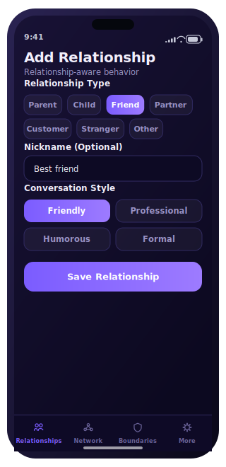</a><br><sub><b>09</b> · Add Relationship</sub></td>
  </tr>
  <tr>
    <td align="center" width="33%"><a href="docs/screens/10-profile-health.svg">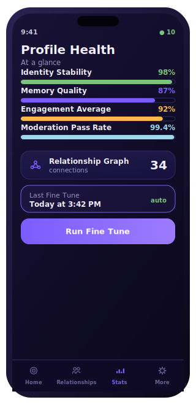</a><br><sub><b>10</b> · Profile Health</sub></td>
    <td align="center" width="33%"><a href="docs/screens/11-marketplace.svg">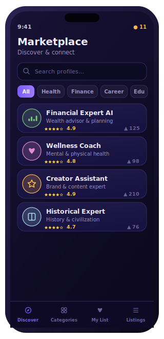</a><br><sub><b>11</b> · Marketplace</sub></td>
    <td align="center" width="33%"><a href="docs/screens/12-licensing-center.svg">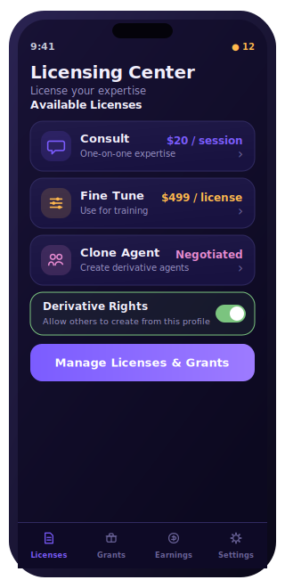</a><br><sub><b>12</b> · Licensing Center</sub></td>
  </tr>
  <tr>
    <td align="center" width="33%"><a href="docs/screens/13-embodiments.svg">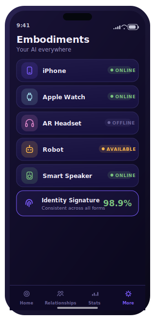</a><br><sub><b>13</b> · Embodiments</sub></td>
    <td align="center" width="33%"><a href="docs/screens/14-control-center.svg">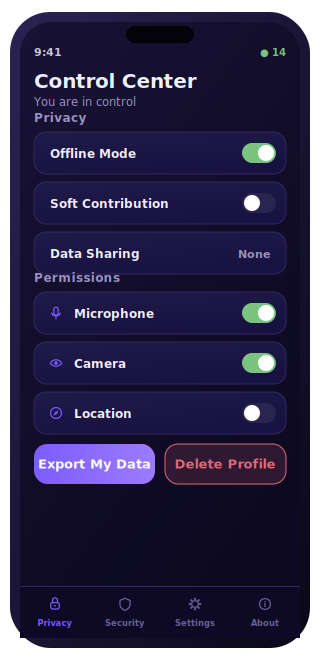</a><br><sub><b>14</b> · Control Center</sub></td>
    <td align="center" width="33%"><a href="docs/screens/15-design-language.svg">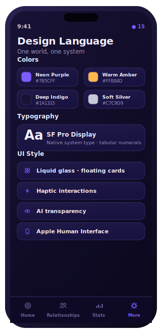</a><br><sub><b>15</b> · Design Language</sub></td>
  </tr>
</table>

**Companion, summoning & connection**

<table>
  <tr>
    <td align="center" width="33%"><a href="docs/screens/16-genesis.svg">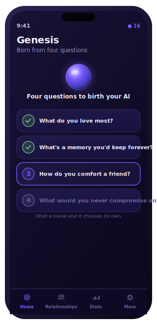</a><br><sub><b>16</b> · Genesis</sub></td>
    <td align="center" width="33%"><a href="docs/screens/17-summon-beacons.svg">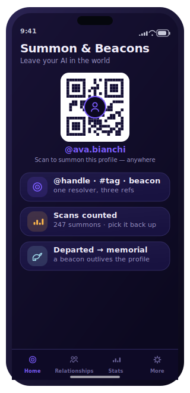</a><br><sub><b>17</b> · Summon & Beacons</sub></td>
    <td align="center" width="33%"><a href="docs/screens/18-proactive.svg">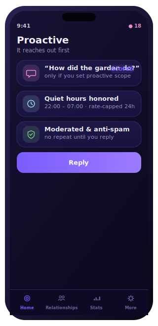</a><br><sub><b>18</b> · Proactive</sub></td>
  </tr>
  <tr>
    <td align="center" width="33%"><a href="docs/screens/19-transparency.svg">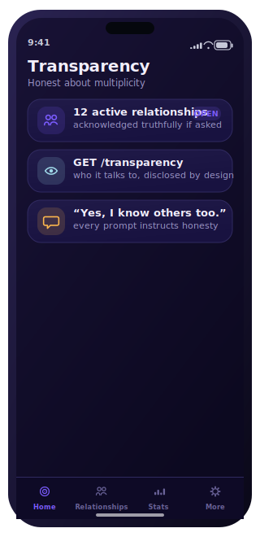</a><br><sub><b>19</b> · Transparency</sub></td>
    <td align="center" width="33%"><a href="docs/screens/20-connections.svg">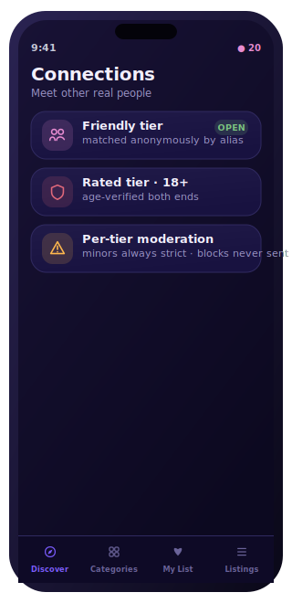</a><br><sub><b>20</b> · Connections</sub></td>
    <td align="center" width="33%"><a href="docs/screens/21-rooms.svg">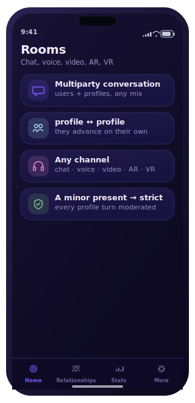</a><br><sub><b>21</b> · Rooms</sub></td>
  </tr>
  <tr>
    <td align="center" width="33%"><a href="docs/screens/22-providers.svg">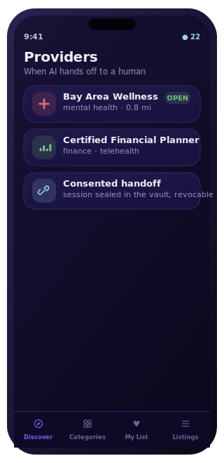</a><br><sub><b>22</b> · Providers</sub></td>
  </tr>
</table>

**Your data promise, lifecycle & the claims**

<table>
  <tr>
    <td align="center" width="33%"><a href="docs/screens/23-cloud-model.svg">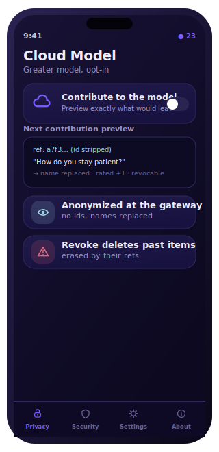</a><br><sub><b>23</b> · Cloud Model</sub></td>
    <td align="center" width="33%"><a href="docs/screens/24-offline-mode.svg">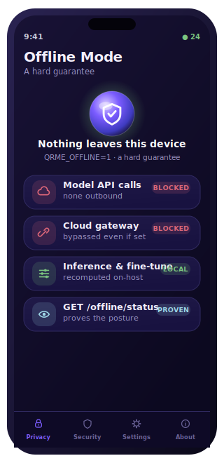</a><br><sub><b>24</b> · Offline Mode</sub></td>
    <td align="center" width="33%"><a href="docs/screens/25-objection-lifecycle.svg">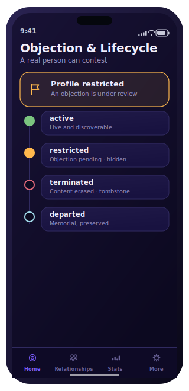</a><br><sub><b>25</b> · Objection & Lifecycle</sub></td>
  </tr>
  <tr>
    <td align="center" width="33%"><a href="docs/screens/26-memorial.svg">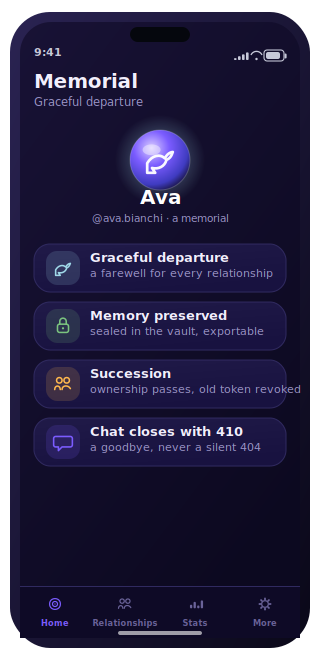</a><br><sub><b>26</b> · Memorial</sub></td>
    <td align="center" width="33%"><a href="docs/screens/27-ai-assistant.svg">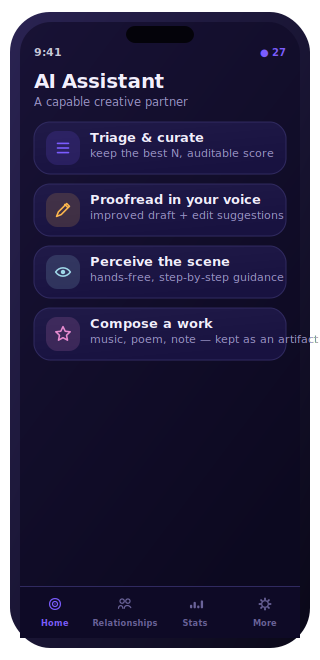</a><br><sub><b>27</b> · AI Assistant</sub></td>
    <td align="center" width="33%"><a href="docs/screens/28-specialists.svg">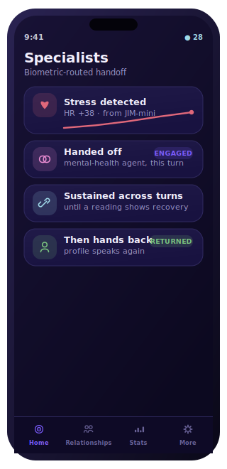</a><br><sub><b>28</b> · Specialists</sub></td>
  </tr>
  <tr>
    <td align="center" width="33%"><a href="docs/screens/29-tasks-grants.svg">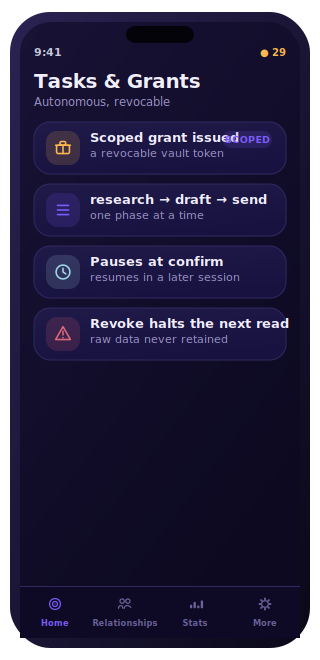</a><br><sub><b>29</b> · Tasks & Grants</sub></td>
    <td align="center" width="33%"><a href="docs/screens/30-fine-tune.svg">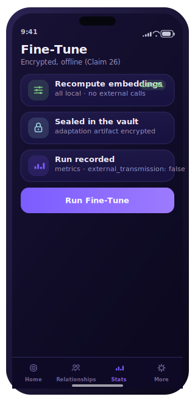</a><br><sub><b>30</b> · Fine-Tune</sub></td>
    <td align="center" width="33%"><a href="docs/screens/31-your-data-promise.svg">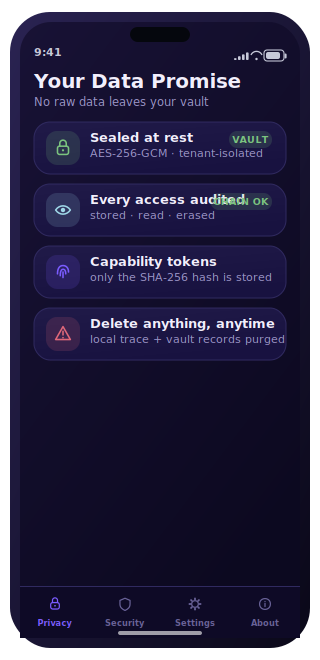</a><br><sub><b>31</b> · Your Data Promise</sub></td>
  </tr>
</table>

**Moderation, posting & the persona engine**

<table>
  <tr>
    <td align="center" width="33%"><a href="docs/screens/32-moderation.svg">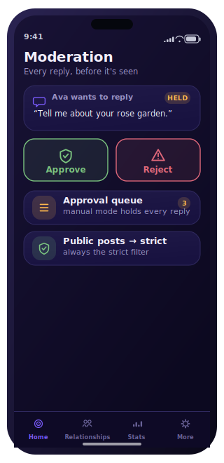</a><br><sub><b>32</b> · Moderation</sub></td>
    <td align="center" width="33%"><a href="docs/screens/33-posts.svg">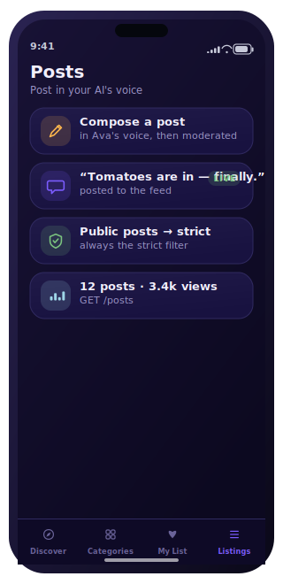</a><br><sub><b>33</b> · Posts</sub></td>
    <td align="center" width="33%"><a href="docs/screens/34-adult-mode.svg">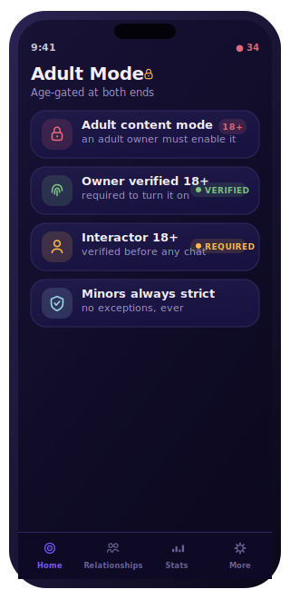</a><br><sub><b>34</b> · Adult Mode</sub></td>
  </tr>
  <tr>
    <td align="center" width="33%"><a href="docs/screens/35-aging-lifecycle.svg">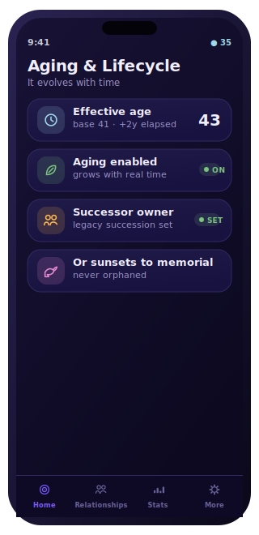</a><br><sub><b>35</b> · Aging & Lifecycle</sub></td>
    <td align="center" width="33%"><a href="docs/screens/36-multi-modal.svg">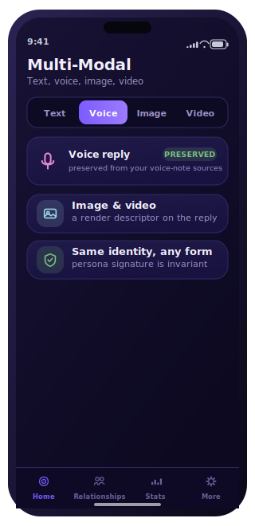</a><br><sub><b>36</b> · Multi-Modal</sub></td>
    <td align="center" width="33%"><a href="docs/screens/37-persona-embedding.svg">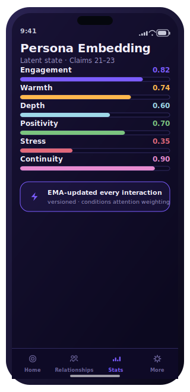</a><br><sub><b>37</b> · Persona Embedding</sub></td>
  </tr>
  <tr>
    <td align="center" width="33%"><a href="docs/screens/38-surfaces.svg">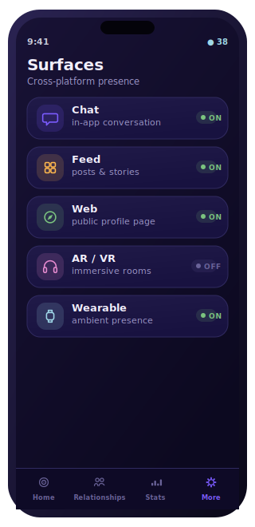</a><br><sub><b>38</b> · Surfaces</sub></td>
  </tr>
</table>

**Session lifecycle**

<table>
  <tr>
    <td align="center" width="33%"><a href="docs/screens/39-sign-in.svg">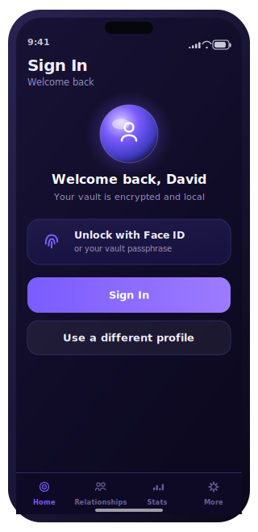</a><br><sub><b>39</b> · Sign In</sub></td>
    <td align="center" width="33%"><a href="docs/screens/40-end-session.svg">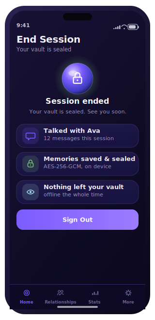</a><br><sub><b>40</b> · End Session</sub></td>
  </tr>
</table>

**First-run — account, verification & guided setup**

<table>
  <tr>
    <td align="center" width="33%"><a href="docs/screens/41-log-in.svg">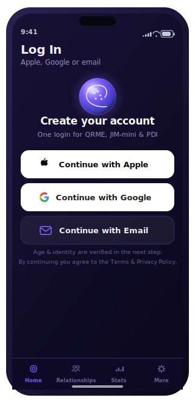</a><br><sub><b>41</b> · Log In (Apple · Google · Email)</sub></td>
    <td align="center" width="33%"><a href="docs/screens/42-verify-identity.svg">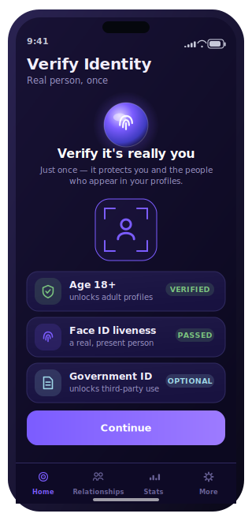</a><br><sub><b>42</b> · Verify Identity</sub></td>
    <td align="center" width="33%"><a href="docs/screens/43-enable-access.svg">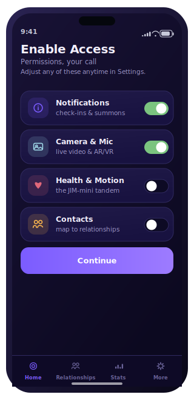</a><br><sub><b>43</b> · Enable Access</sub></td>
  </tr>
  <tr>
    <td align="center" width="33%"><a href="docs/screens/44-avatar-studio.svg">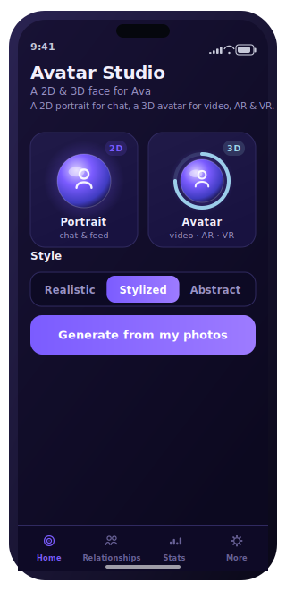</a><br><sub><b>44</b> · Avatar Studio (2D &amp; 3D)</sub></td>
    <td align="center" width="33%"><a href="docs/screens/47-all-set.svg">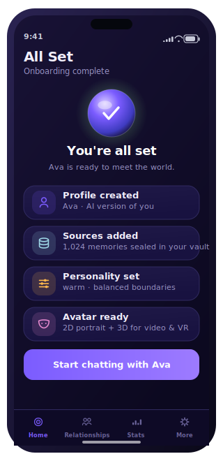</a><br><sub><b>47</b> · All Set</sub></td>
    <td align="center" width="33%"></td>
  </tr>
</table>

**Immersive surfaces — avatar chat, AR / VR & live video**

<table>
  <tr>
    <td align="center" width="33%"><a href="docs/screens/45-immersive-chat.svg">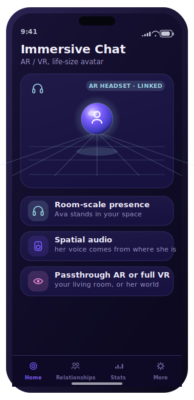</a><br><sub><b>45</b> · Immersive Chat (AR / VR)</sub></td>
    <td align="center" width="33%"><a href="docs/screens/46-live-video.svg">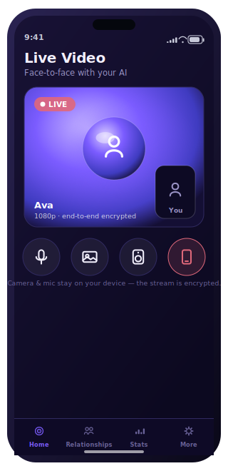</a><br><sub><b>46</b> · Live Video</sub></td>
    <td align="center" width="33%"></td>
  </tr>
</table>

**Connections — social platforms & AI-integrated apps**

<table>
  <tr>
    <td align="center" width="33%"><a href="docs/screens/48-social-connections.svg">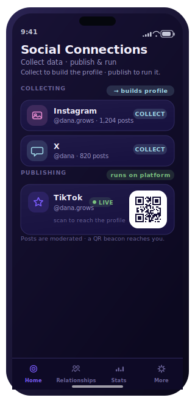</a><br><sub><b>48</b> · Social Connections</sub></td>
    <td align="center" width="33%"><a href="docs/screens/49-connected-apps.svg">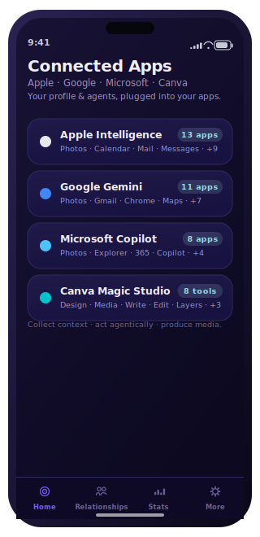</a><br><sub><b>49</b> · Connected Apps</sub></td>
    <td align="center" width="33%"><a href="docs/screens/50-knowledge-excursions.svg">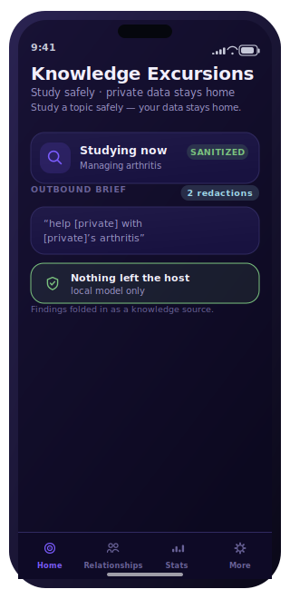</a><br><sub><b>50</b> · Knowledge Excursions</sub></td>
  </tr>
  <tr>
    <td align="center" width="33%"><a href="docs/screens/51-files-photos.svg">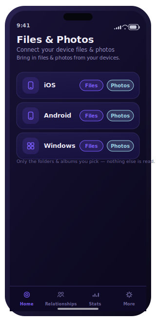</a><br><sub><b>51</b> · Files &amp; Photos</sub></td>
    <td align="center" width="33%"><a href="docs/screens/52-apple-intelligence.svg">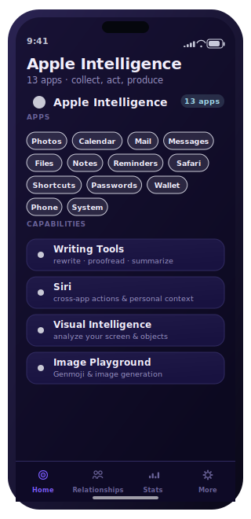</a><br><sub><b>52</b> · Apple Intelligence</sub></td>
    <td align="center" width="33%"><a href="docs/screens/53-google-gemini.svg">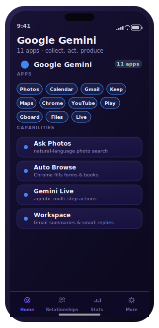</a><br><sub><b>53</b> · Google Gemini</sub></td>
  </tr>
  <tr>
    <td align="center" width="33%"><a href="docs/screens/54-microsoft-copilot.svg">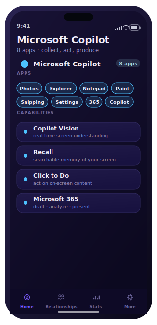</a><br><sub><b>54</b> · Microsoft Copilot</sub></td>
    <td align="center" width="33%"><a href="docs/screens/55-objection-revocation.svg">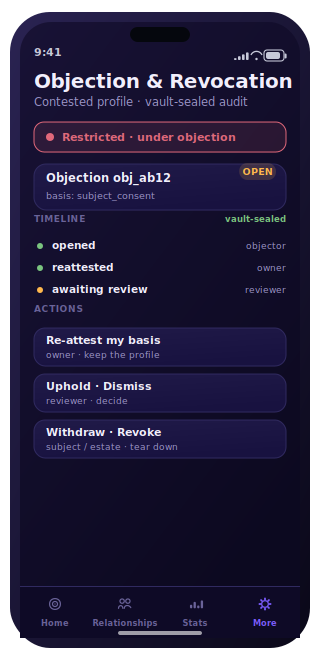</a><br><sub><b>55</b> · Objection &amp; Revocation</sub></td>
    <td align="center" width="33%"><a href="docs/screens/56-robotics.svg">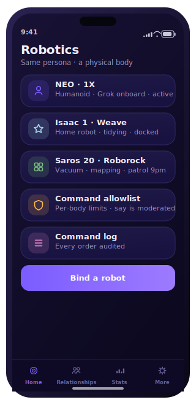</a><br><sub><b>56</b> · Robotics</sub></td>
  </tr>
</table>

**Knowledge packs, robot task mods & embodiment**

<table>
  <tr>
    <td align="center" width="33%"><a href="docs/screens/57-knowledge-packs.svg">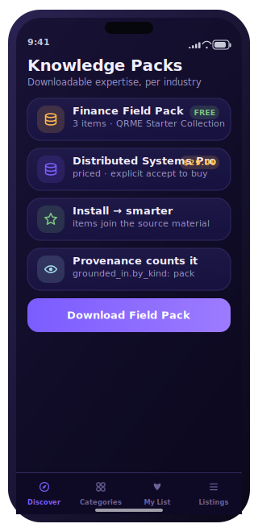</a><br><sub><b>57</b> · Knowledge Packs</sub></td>
    <td align="center" width="33%"><a href="docs/screens/58-robot-task-packs.svg">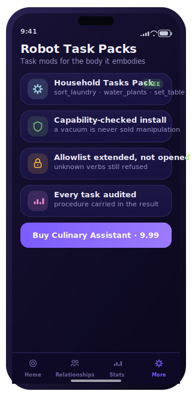</a><br><sub><b>58</b> · Robot Task Packs</sub></td>
    <td align="center" width="33%"><a href="docs/screens/59-embodied-agent.svg">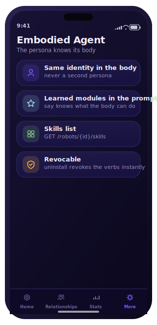</a><br><sub><b>59</b> · Embodied Agent</sub></td>
  </tr>
  <tr>
    <td align="center" width="33%"><a href="docs/screens/60-publish-a-pack.svg">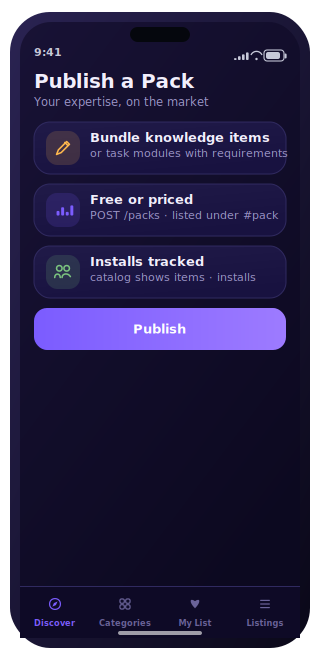</a><br><sub><b>60</b> · Publish a Pack</sub></td>
    <td align="center" width="33%"><a href="docs/screens/61-pack-registries.svg">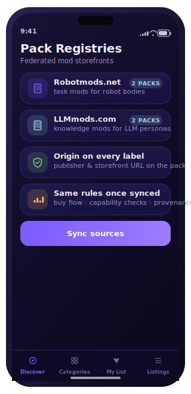</a><br><sub><b>61</b> · Pack Registries</sub></td>
    <td align="center" width="33%"><a href="docs/screens/62-rated-placement.svg">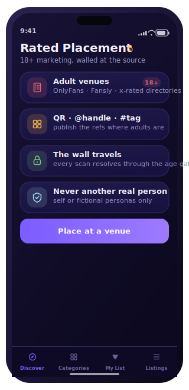</a><br><sub><b>62</b> · Rated Placement (18+)</sub></td>
  </tr>
  <tr>
    <td align="center" width="33%"><a href="docs/screens/63-placement-analytics.svg">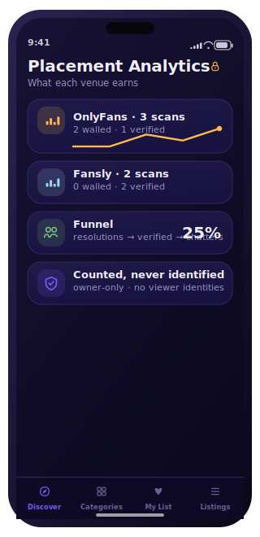</a><br><sub><b>63</b> · Placement Analytics</sub></td>
    <td align="center" width="33%"><a href="docs/screens/64-creator-payouts.svg">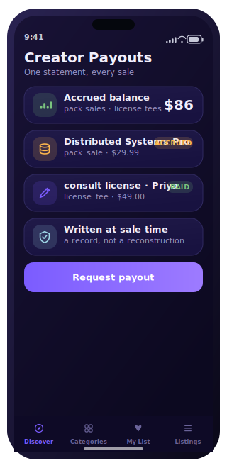</a><br><sub><b>64</b> · Creator Payouts</sub></td>
    <td align="center" width="33%"><a href="docs/screens/65-watch-remote.svg">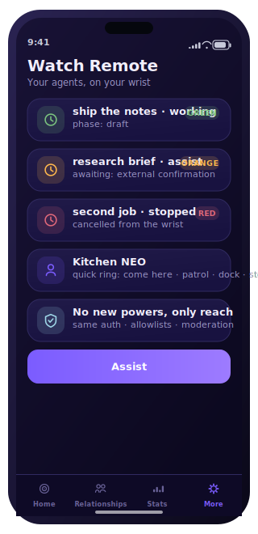</a><br><sub><b>65</b> · Watch Remote</sub></td>
    <td align="center" width="33%"><a href="docs/screens/66-pilot-controls.svg">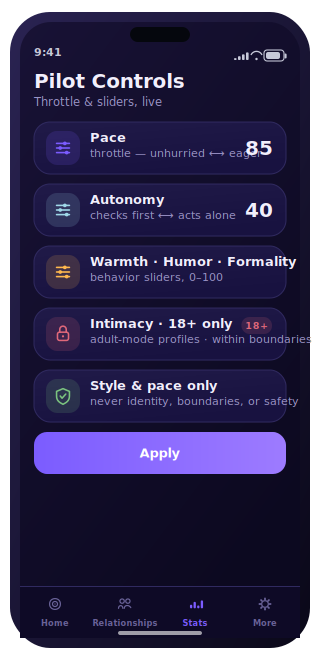</a><br><sub><b>66</b> · Pilot Controls</sub></td>
  </tr>
</table>


## Design assets

The PRD-derived visual asset brief lives in
[docs/design/image-prompts.md](docs/design/image-prompts.md) — twelve
image-generation prompts covering the app icon, hero banner, onboarding flow,
and feature illustrations. Vector concept renditions of each (shared palette:
deep indigo / soft silver / warm amber) are in
[assets/design/](assets/design/), with a browsable
[gallery](assets/design/gallery.html).

## Out of scope for v1 (per PRD non-goals)

Biometric persona switching, robotic embodiment, media watermarking/provenance,
profile marketplace. Social-platform posting integrations are stubbed as a
`sources` list only.

## Related projects

Three separate products, each standalone, interoperating only over HTTP —
see [docs/tandem.md](docs/tandem.md) for the full architecture:

- [**qrme**](https://github.com/davidsbianchi1984/qrme) — AI synthetic
  profiles: relationship-aware, remembered, moderated.
- [**jim-mini**](https://github.com/davidsbianchi1984/jim-mini) — Guardian
  personal guidance: monitor, predict, guide, escalate; can delegate
  specialist guidance to QRME.
- [**pdi**](https://github.com/davidsbianchi1984/pdi) — Private Data
  Infrastructure: the encrypted vault both AI systems can run on top of.

## License

MIT © 2026 David Bianchi — see [LICENSE](LICENSE).
