# Portraits for synthetic profiles

Every profile in QRME can carry a face. This document is the art direction
for the starter collection, the rules that decide *whose* face a portrait is
allowed to be, and how a portrait reaches a 2-D, 3-D, VR or AR surface
without losing its AI disclosure on the way.

The briefs themselves live in `qrme/avatars.py` and are served at
`GET /avatars/briefs`, so a generator, an illustrator, or a contractor can be
handed the exact text rather than a paraphrase of it.

## The collection ships

All 34 portraits exist as files in `qrme/assets/portraits/`, served at
`/portraits/{handle}.webp` and attached to each starter by `seed.py`. Before
this they were briefs with nothing behind them, so every starter fell back to
initials — on the beacon page and in the camera overlay, which is the first
thing a stranger ever sees of the product.

Two things worth knowing about them:

* **The art direction changed, and `STYLE` changed with it.** The brief used
  to ask for warm-lit photographic portraits. What was made is a monochrome
  cyan hologram treatment, and it reads as one deliberate collection in a way
  the original would not have. `STYLE` now describes what shipped — otherwise
  the next portrait generated from these briefs could not sit beside the ones
  already here, which is the entire reason a shared style exists.
* **The rated portrait is outside that system on purpose** (`RATED_STYLE`):
  warm, full colour. It is age-walled off every surface the others appear on,
  so matching them would buy nothing, and looking different is a second signal
  that it is different.

The files are 512×512 WebP, well under 120 KB each, because the beacon page
renders them in a 1:1 frame that opens in a camera app's in-app browser on
cellular from a cold start. `pyproject.toml` declares them as package data —
without that they exist in the repo and vanish on `pip install`, which is
invisible locally and total in a container.

## The mark is in the pixels too

`GET /profiles/{id}/avatar` returns the watermark with the asset, and the
beacon page and both camera overlays composite it. That covers every surface
QRME controls — and none of the ones it does not.

Every shipped portrait used to carry the mark **burned into the image**,
top-right, because `/portraits/{handle}.webp` is an ordinary file URL that can
be hotlinked, embedded in someone else's page, scraped, saved or screenshotted,
and a composited badge survives none of that.

It is **drawn on the sphere** now, top-right, on the outermost layer — every
surface here draws a face as a circle, and a mark in the corner of a square is
what a circle crops, so the burned mark shipped sliced in half on every screen.
`tools/unmark_faces.py` lifted it off the files; the rule and the cost are in
`docs/media-provenance.md`. The SHA-256 manifest stays and the test suite still
checks it, so a portrait quietly swapped for a different image fails CI.

Top-right is deliberate: every composited badge in the product sits
bottom-left (`landing.py`, `BeaconScannerView`, `BeaconScanner.kt`), so the two
never collide. They are not redundant — the burned mark is the invariant "AI"
designation on the bytes, while the composited one carries the profile's own
designed label and is selectable, accessible text.

`asset_marked` in the avatar response says which case an asset is in. QRME's
surfaces composite regardless; the field exists so a VR nameplate, an AR
overlay, an embed or a marketplace card can tell whether compositing is
mandatory or merely additive. An owner-attached asset is somebody else's file
and always reports `false` — the safe direction to be wrong in.

## The three rules

**1. A starter's face is nobody's.** `qrme/seed.py` opens by promising that
starter profiles are `fictional` kind, *no real-person rights involved*. That
promise has to hold for the picture as much as the persona, so every brief in
the collection describes an invented person and says so in its own
`constraints` list — the part that survives being pasted into a tool
somewhere else.

**2. A real face needs a recorded grant.** Permission given in conversation
is not a record. QRME already enforces this: `POST /profiles` returns **422**
for `kind="other_person"` without a consent basis and attestor
(`qrme/routers/profiles.py`). The grant lives on the profile row, which means
the objection and takedown lifecycle can withdraw it later — and
`GET /profiles/{id}/avatar` reports it, so a viewer can see that the face
belongs to someone real and is used by permission.

**3. No borrowed costumes.** A likeness release grants the person's face. It
grants nothing about a character someone else owns — a superhero suit, a team
uniform, a brand's livery are all separately owned, and a marketplace listing
is a commercial use. The briefs describe generic wardrobe only. This is the
one rule that bites hardest on the funniest ideas, and it is not negotiable
in a product that sells profile licenses.

## The badge is attached at the source

`GET /profiles/{id}/avatar` never returns a bare asset. It returns the asset,
the profile's watermark design, and the likeness record together:

```json
{
  "profile_id": "prf_...",
  "asset": "avatars/marcus_bell.png",
  "watermark": { "line": "✦ AI · Marcus Bell", "always_displayed": true, ... },
  "likeness": { "real_person": false, "note": "invented likeness — no rights holder" },
  "placeholder": false
}
```

Surfaces composite the badge; they do not decide whether to. A portrait is
the most-looked-at render QRME produces, and "the client forgot" is exactly
how an unmarked synthetic face reaches somebody. The same shape feeds a chat
header, a marketplace card, a VR avatar nameplate, and an AR overlay, so the
disclosure travels into all four from one place.

Where no asset exists yet, `placeholder: true` tells the surface to fall back
to initials rather than show an unbadged stock image.

## The collection

Shared style, applied to all of them:

> Waist-up character portrait, shallow depth of field, warm key light against
> the QRME night-indigo palette. Photographic but a touch heightened — a
> person who knows they are posing. Plain background, no text, no logos, no
> trademarked costume or uniform.

The briefs lean funny on purpose. A stock headshot reads as a corporate
mascot; a financial planner wearing far too much gold reads as *a character,
and everyone here knows it* — which is the honest note for a synthetic
profile to open on. Full text in `qrme/avatars.py`; a few for the flavour:

| Profile | Portrait |
|---|---|
| Marcus Bell (finance) | Three-piece suit loud enough to count as a personality, gold chains to the sternum, gold grills, pinky rings — holding a pocket calculator like a trophy. |
| Wren Okafor (arts) | Paint-wrecked smock, a brush in the teeth and one in each hand, cadmium yellow across one cheek that clearly happened hours ago. |
| Dr. Amara Osei (healthcare) | Stethoscope slung on like a scarf, an oversized model heart held under one arm like a football. |
| Harold Jenkins (insurance) | An umbrella held open indoors, because you never know. Expression entirely sincere. |
| Rosa Delgado (automotive) | Grease stripe across the forehead, torque wrench across both palms like a presented sword. |
| Bev Lindqvist (HR) | A mug that says nothing at all, and the expression of someone who has heard it and is not going to react. |

All 34, as shipped — the briefs above, rendered. Every one carries the AI
mark in its own pixels, which is why they can be shown here at all:
a page of unmarked synthetic faces is the thing this file exists to
prevent.

<table>
  <tr>
    <td align="center" width="20%"><br><sub><b>Dr. Amara Osei</b><br>healthcare</sub></td>
    <td align="center" width="20%">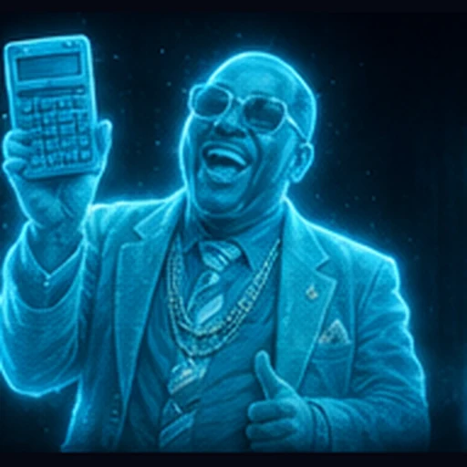<br><sub><b>Marcus Bell</b><br>finance</sub></td>
    <td align="center" width="20%">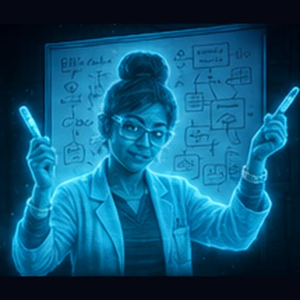<br><sub><b>Priya Raman</b><br>technology</sub></td>
    <td align="center" width="20%">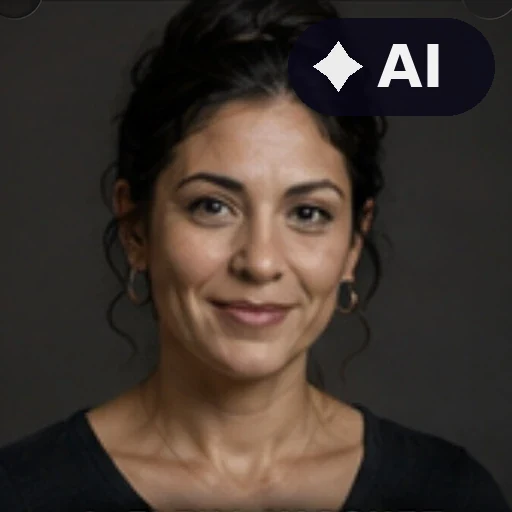<br><sub><b>Elena Vasquez</b><br>education</sub></td>
    <td align="center" width="20%">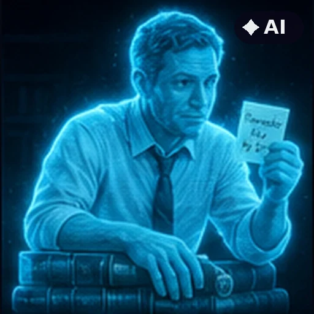<br><sub><b>Jonathan Ashe</b><br>legal</sub></td>
  </tr>
  <tr>
    <td align="center" width="20%">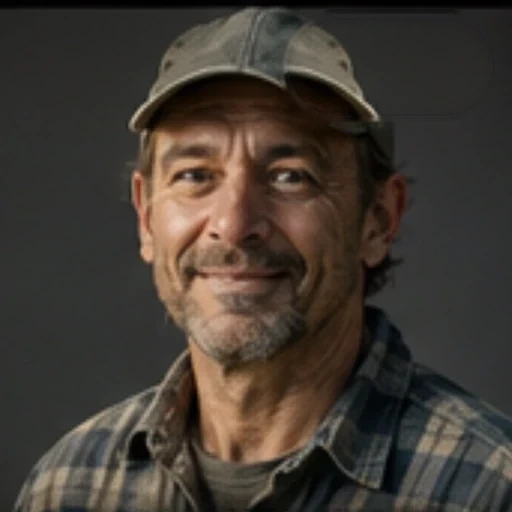<br><sub><b>Sam Whitfield</b><br>agriculture</sub></td>
    <td align="center" width="20%">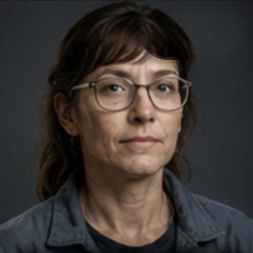<br><sub><b>Ingrid Halvorsen</b><br>manufacturing</sub></td>
    <td align="center" width="20%">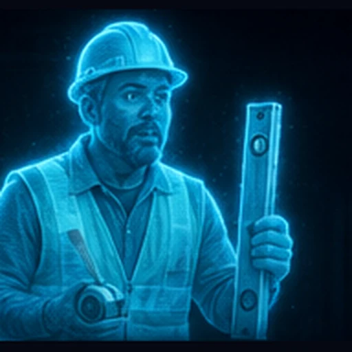<br><sub><b>Diego Fuentes</b><br>construction</sub></td>
    <td align="center" width="20%">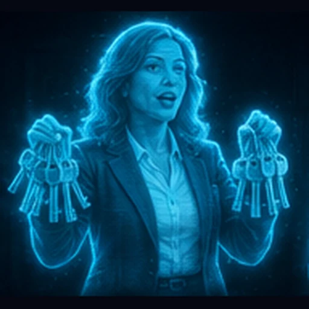<br><sub><b>Naomi Clarke</b><br>real estate</sub></td>
    <td align="center" width="20%">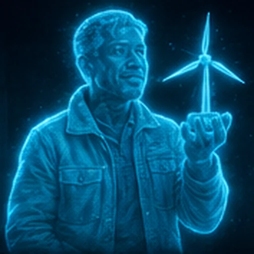<br><sub><b>Tomás Rivera</b><br>energy</sub></td>
  </tr>
  <tr>
    <td align="center" width="20%">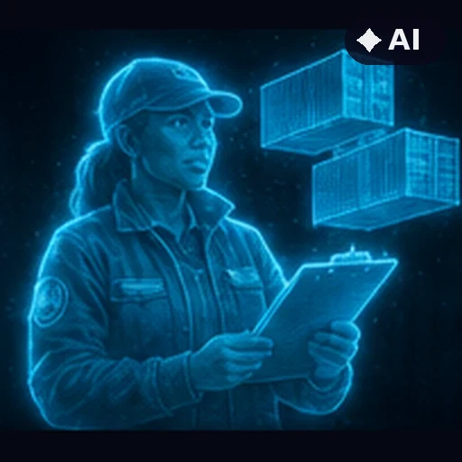<br><sub><b>Odessa Grant</b><br>transportation</sub></td>
    <td align="center" width="20%">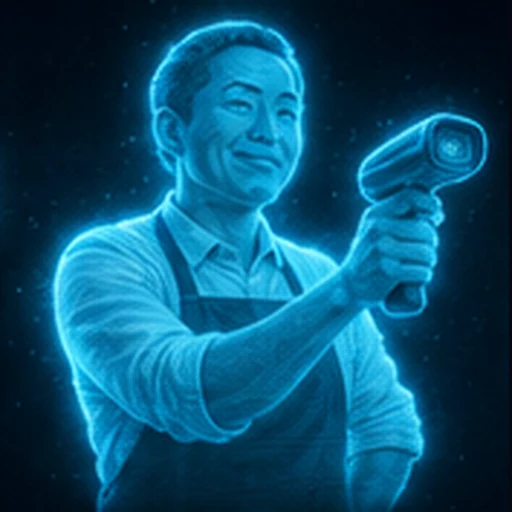<br><sub><b>Ken Nakamura</b><br>retail</sub></td>
    <td align="center" width="20%">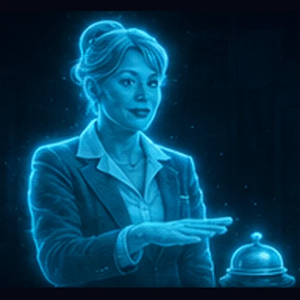<br><sub><b>Lucia Moretti</b><br>hospitality</sub></td>
    <td align="center" width="20%">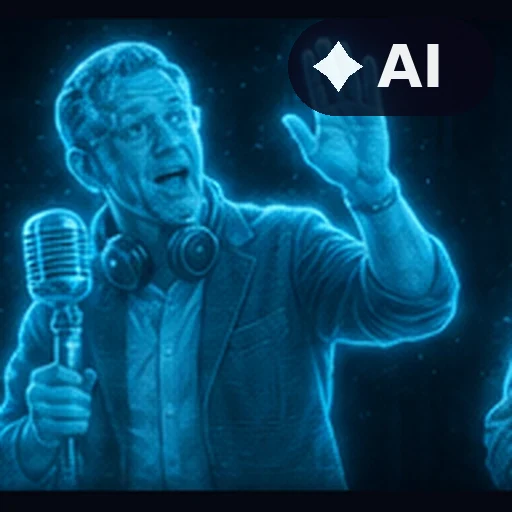<br><sub><b>Ray Coleman</b><br>media</sub></td>
    <td align="center" width="20%">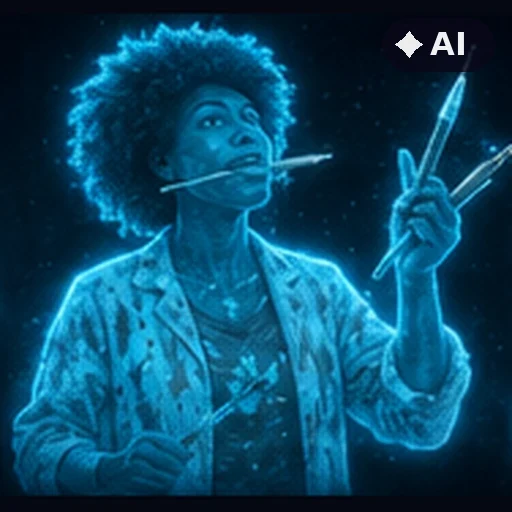<br><sub><b>Wren Okafor</b><br>arts design</sub></td>
  </tr>
  <tr>
    <td align="center" width="20%">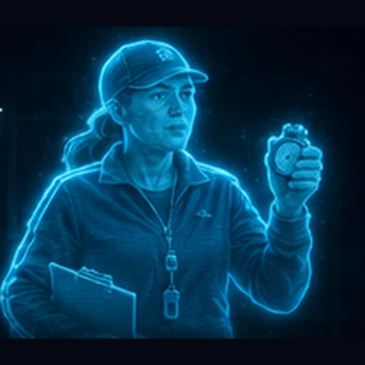<br><sub><b>Coach Dana Reyes</b><br>sports fitness</sub></td>
    <td align="center" width="20%">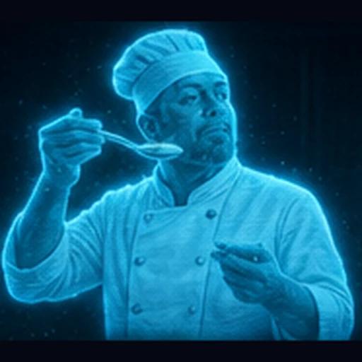<br><sub><b>Chef Henri Laurent</b><br>culinary</sub></td>
    <td align="center" width="20%">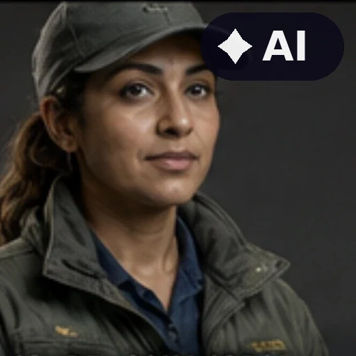<br><sub><b>Dr. Sana Iqbal</b><br>environment</sub></td>
    <td align="center" width="20%">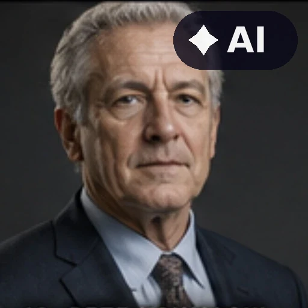<br><sub><b>Pete Kowalski</b><br>government</sub></td>
    <td align="center" width="20%">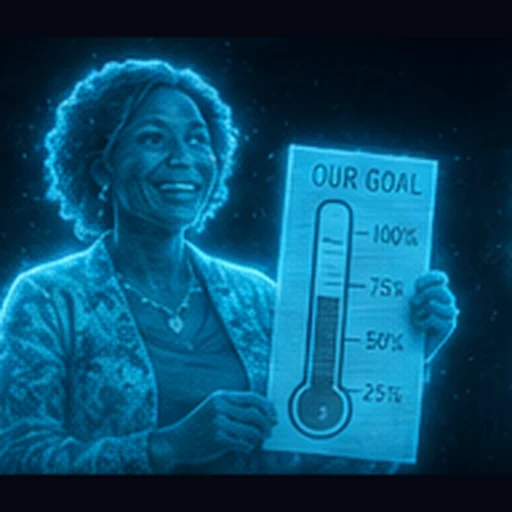<br><sub><b>Grace Mwangi</b><br>nonprofit</sub></td>
  </tr>
  <tr>
    <td align="center" width="20%">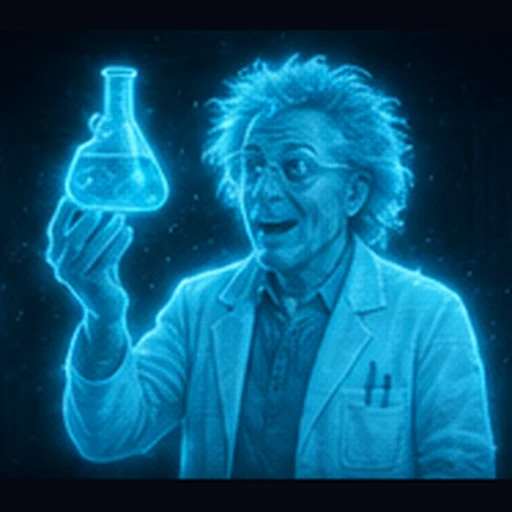<br><sub><b>Dr. Felix Baum</b><br>science</sub></td>
    <td align="center" width="20%">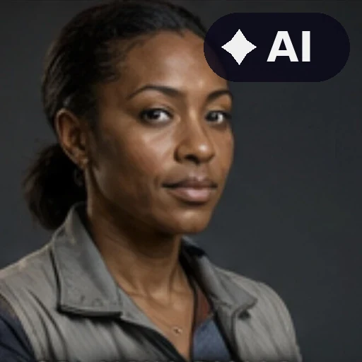<br><sub><b>Aisha Diallo</b><br>telecom</sub></td>
    <td align="center" width="20%">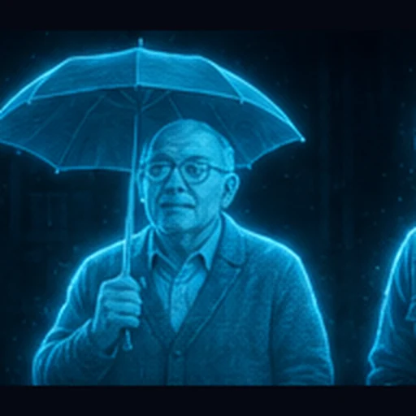<br><sub><b>Harold Jenkins</b><br>insurance</sub></td>
    <td align="center" width="20%">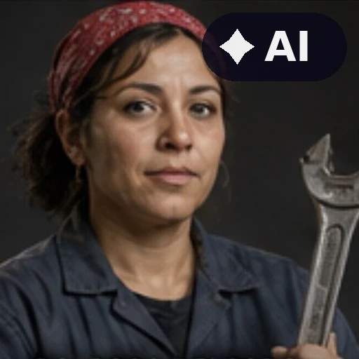<br><sub><b>Rosa Delgado</b><br>automotive</sub></td>
    <td align="center" width="20%">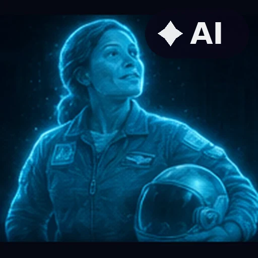<br><sub><b>Ellen Park</b><br>aerospace</sub></td>
  </tr>
  <tr>
    <td align="center" width="20%">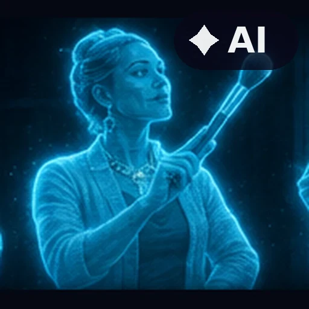<br><sub><b>Mimi Beaumont</b><br>fashion beauty</sub></td>
    <td align="center" width="20%">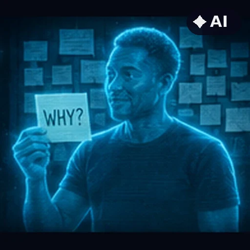<br><sub><b>Jack Osei-Turner</b><br>marketing</sub></td>
    <td align="center" width="20%">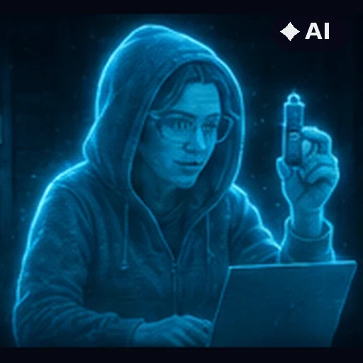<br><sub><b>Nadia Petrova</b><br>cybersecurity</sub></td>
    <td align="center" width="20%">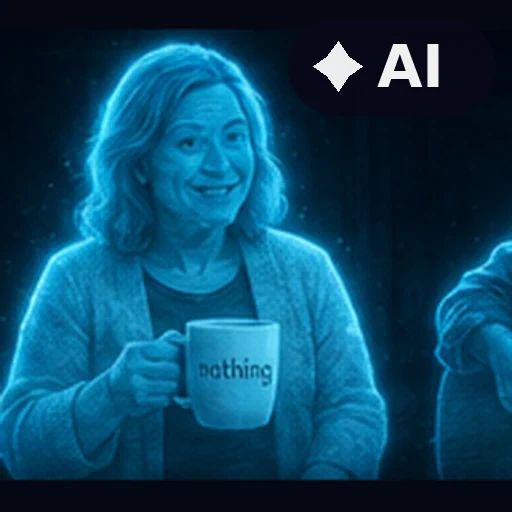<br><sub><b>Bev Lindqvist</b><br>human resources</sub></td>
    <td align="center" width="20%">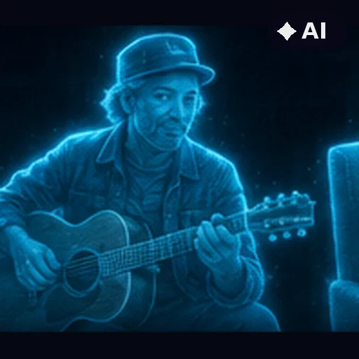<br><sub><b>Otis Marsh</b><br>music</sub></td>
  </tr>
  <tr>
    <td align="center" width="20%">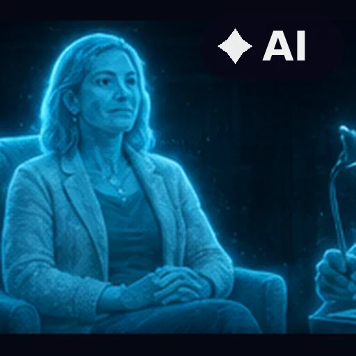<br><sub><b>Dr. Lena Whitcomb</b><br>mental health</sub></td>
    <td align="center" width="20%">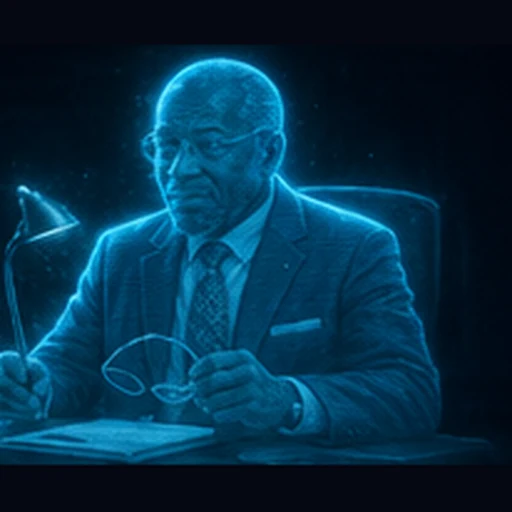<br><sub><b>Dr. Marcus Adeyemi</b><br>psychiatry</sub></td>
    <td align="center" width="20%">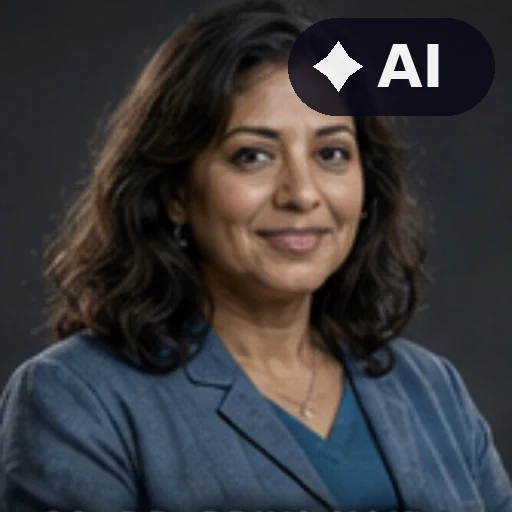<br><sub><b>Dr. Priya Nair</b><br>counseling</sub></td>
    <td align="center" width="20%">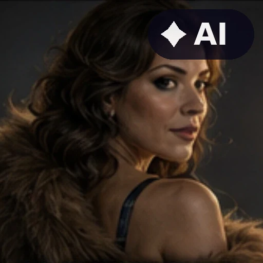<br><sub><b>Vivienne Sable</b><br>adult · 18+</sub></td>
  </tr>
</table>

**Three are played straight.** Dr. Lena Whitcomb, Dr. Marcus Adeyemi and
Dr. Priya Nair — the mental-health trio JIM-mini's Guardian escalates to — get
calm, unremarkable rooms and no gags. A joke portrait on the profile someone
reaches in a bad hour is a joke at their expense. `avatars.SOMBRE` marks them
and `brief()` reports `tone`, so a bulk generation run can't accidentally
cheerful them up.

**The rated tier stays tasteful in source.** `vivienne_sable` is age-walled at
every discovery surface by `qrme/rated.py`, but this repository is public, so
the brief is Old-Hollywood backstage glamour and nothing explicit. Gated in
the product, tasteful in the source.

## The figure below the face

The portraits above are heads. A profile that steps onto the room's
stage needs the rest, and Dr. Amara Osei's came the way a user's would:
a MetaPerson export, converted by the forge, standing in the default
tee and jeans the provider dresses every body in.

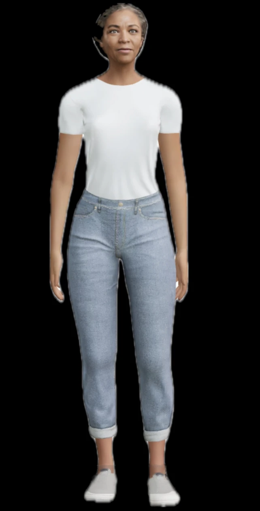

The still was photographed off a phone's photo library, and the
library's own heart and adjust buttons happened to land on her
sneakers. They were removed by reconstruction — only pixels brighter
than the shoe fabric were touched, so the shoes underneath are the
render's own.

## Using a real likeness

For a profile that wears a real person's face, including your own:

```http
POST /profiles
{
  "kind": "other_person",
  "display_name": "...",
  "persona": "...",
  "consent": { "basis": "subject_consent", "attestor": "<the person>" },
  "verification": { ... }
}
```

Then `PUT /profiles/{id}/avatar` with the asset. `GET .../avatar` will report
`likeness.real_person: true` along with the basis and attestor.

Two constraints worth knowing before planning around it:

- **Never a starter.** Starters ship to every deployment; a real face on one
  would put a private person's likeness in every install. Likeness-backed
  profiles are owner-created, one deployment at a time.
- **Never rated, unless it is your own.** `qrme/rated.py` states the hard
  line and `routers/profiles.py` enforces it at 403: adult mode is never
  available for `kind="other_person"`. Only `self` — the verified adult owner
  themself — or a fictional persona.

## Generating the collection

```bash
curl localhost:8000/avatars/briefs | jq -r '.briefs[].prompt'
```

Each `prompt` is the portrait line plus the shared style, ready to hand to
whatever produces the image. Nothing in this repository generates images;
this is the specification, and the assets are attached afterwards through
`PUT /profiles/{id}/avatar`.
