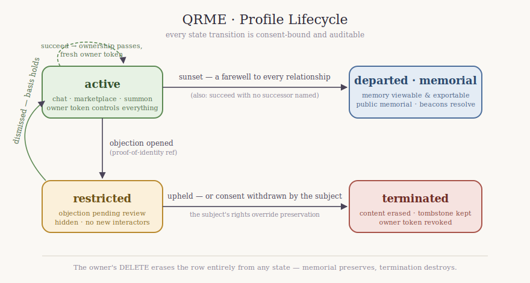

# QRME lifecycle, consent & rights

The detailed rules behind creating profiles of real people, what happens when
they object, succession and memorial states, and adult content between
profiles. **[implemented]** = in code and tested; **[planned]** = intended
design not yet coded.

## Third-party profiles: consent & rights **[implemented + planned]**

Creating a profile of a real person other than yourself (`kind:
other_person`) **requires a consent/rights record** — the API rejects it
otherwise (422). The record captures a `basis` and an `attestor`:
**[implemented]**

| basis | when it applies |
|---|---|
| `subject_consent` | the person consented (living subject) |
| `estate_authorization` | a deceased person, authorized by their estate/next of kin |
| `public_figure_commentary` | a public figure, for commentary/parody within rights limits |

**Objection & takedown flow** **[implemented]** (`qrme/routers/governance.py`):
a real person (or their estate) can object to a profile that represents them.

1. `POST /objections` with a proof-of-identity reference opens a case against a
   profile (public — the objecting party needs no account); the profile is
   immediately moved to `restricted` (no public surfaces, no new interactors)
   pending review.
2. The owner re-attests their `basis` within the window
   (`POST /profiles/{id}/objections/{obj}/attest`, owner-gated).
3. Resolution by a **reviewer** (`POST /objections/{obj}/resolve`, guarded by
   `QRME_ADMIN_TOKEN` so an owner can't adjudicate their own case): `uphold`
   **terminates** the profile (see below); `dismiss` returns it to active with
   the objection recorded.
4. Consent is **revocable**: a `subject_consent` subject can withdraw at any
   time (`POST /objections/{obj}/withdraw`), which forces termination.
   Withdrawal is honored even mid-review; it is refused for non-subject-consent
   bases (estate/public-figure go through review).

## Ownership succession **[implemented]**

`successor_owner` is set at creation/update. When the original owner dies or
is incapacitated:

- `POST /profiles/{id}/succeed` transfers ownership to the named
  `successor_owner` after a verification step (a death-certificate /
  power-of-attorney reference reviewed out-of-band; the endpoint is
  reviewer-gated via `QRME_ADMIN_TOKEN`, since the original owner may be
  unable to authorize). The old owner token is revoked and a fresh one is
  minted for the successor — control (edit, moderation, boundaries,
  termination) passes with it.
- If no successor is named, the profile sunsets to **memorial** on the
  confirmed owner-death signal — farewells sent, frozen rather than orphaned.
- `GET /profiles/{id}/memorial` (public) is the departed profile's memorial:
  name, handle, purpose, physical memorial anchors (beacons), and how many
  relationships it touched — never persona internals.

## Lifecycle states **[implemented: active/restricted/departed/terminated]**



```
   active ──sunset──▶ departed (memorial)
     │                   │
     │ objection         │ (memory viewable, chat closed, archive sealed)
     ▼                   ▼
  restricted ──fail──▶ terminated (erased)
```

- **active** — normal operation. **[implemented]**
- **departed / memorial** — `POST /profiles/{id}/sunset`: a farewell to every
  relationship, then `status='departed'`; chat returns 410, **memory and
  export remain**, the departure record is sealed in PDI. This *is* the
  memorial state — what stays locked: no new turns, no new relationships, no
  surface changes; what stays open: viewing and exporting memory, beacon
  resolution as a memorial. **[implemented]**
- **restricted** — objection pending; public surfaces off (hidden from
  marketplace and un-chattable via summon), no new interactors (only an
  existing relationship may continue). **[implemented]**
- **terminated** — content erased with a tombstone left, chat returns 410, not
  discoverable; reached via an upheld objection or a consent withdrawal, and
  the owner's `DELETE /profiles/{id}` still removes the row entirely. Distinct
  from memorial: termination destroys, memorial preserves. **[implemented]**

**Memorial vs. termination decision**: an owner (or successor) chooses at
end-of-life — sunset to memorial (family keeps the voice) or delete to
terminate (nothing remains). An *objection* that fails forces termination
regardless, because the subject's rights override preservation.

## Adult content between profiles **[implemented rules + planned extensions]**

Foundations in code **[implemented]**:

- Adult mode requires a verified-adult owner to enable and a verified-18+
  interactor to chat (age-gated at both ends).
- The `maturity` dial (`strict`/`balanced`/`open`) governs the moderation
  filter; **minors are always held to strict**, and `strict` blocks flagged
  content even for verified adults.
- In **rooms** and **connections**, a minor participant forces the whole
  exchange to strict; the `rated` connection tier requires *both* parties
  verified 18+.

Rules specific to two **synthetic** profiles **[planned]**:

- Adult content between two profiles is permitted only when **both** owners
  have enabled adult mode on their profile *and* both are verified-adult
  owners; the room/exchange runs `open` only if every human participant is
  also verified 18+ — any minor (or unverified) party forces strict.
- If **either** profile is a `other_person` third-party profile, adult
  content is **disallowed** unless the `basis` is `subject_consent` with an
  explicit adult-content consent flag — estate-authorized and public-figure
  profiles can never be placed in adult scenarios (dignity / rights floor).
- Adult activity is kept out of shared/exported memory scope and never
  contributed to the cloud model.

## Marketplace full flow **[implemented core + planned commerce]**

**[implemented]**: listing (`POST /marketplace/listings` for profiles,
content, expertise, services), discovery (`GET /marketplace/listings` by
kind/tag/area), the profile-card marketplace, and `#tag` summoning.
Discovery cards never expose persona internals and anonymous profiles stay
anonymous.

**[planned]** commerce layer: `price`/`currency` on a listing; `POST
/listings/{id}/purchase` opening an escrowed order; **ownership transfer** for
profile sales (reassigns `owner_id`, moves succession, re-keys any vaulted
source material to the buyer's tenant); `ratings` (1–5 with text, one per
completed purchase); and `disputes` (buyer opens within a window → listing
frozen → admin resolution → refund/transfer reversal). Ratings and disputes
are append-only and auditable.

## Summoning: collisions, transfer, expiration **[implemented + planned]**

**[implemented]**: `@handle` is unique and normalized (lowercase); claiming a
taken handle 409s, re-claiming your own is fine. `#tag` resolves through
marketplace tags. Beacons carry a token, count scans, can be picked up
(`active=0` → 410), and resolve as memorials for departed profiles.

**[planned]**: handle **transfer** rides profile ownership transfer (the
handle follows the profile); handle **release** frees it after a grace period
so squatted handles recycle; beacon **expiration** via an optional
`expires_at`; QR beacons rotate their token on a schedule so a
photographed-and-shared code can be invalidated without moving the physical
anchor.

## Proactive companionship: triggers & anti-spam **[implemented + planned]**

**[implemented]**: proactive outreach requires the owner to set
`interaction_scope: proactive` (403 otherwise); the check-in is moderated and
lands in shared memory; the reason is chosen from engagement state
("re-connect" when quiet, else "checking in").

**[implemented]** limits (`qrme/common.proactive_gate`, `proactive_state`
table): a per-relationship **rate cap** (default one unprompted outreach per
24 h, configurable via `proactive_min_interval_hours` on the profile), the
recipient's **quiet-hours** window (`PUT /interactors/{id}/quiet-hours`,
UTC-hour window, wraps midnight), and a **reply-suppression** rule — no
further unprompted outreach until the recipient has replied at least once (a
chat message clears the suppression). A blocked outreach returns `429`.

## Multi-modal, surfaces, cloud opt-in, maturity enforcement

These are **[implemented]** and documented in the README API tables:
`ChatRequest.modality` render descriptors (voice reports preservation basis);
`PUT/GET /profiles/{id}/surfaces` with chat-side surface validation; the
per-profile `cloud_contribution` opt-in (positively-rated, anonymized
exchanges only, revocable via `PATCH`); and maturity enforcement (minors
always strict, everywhere — chat, rooms, connections, compose, creative).
