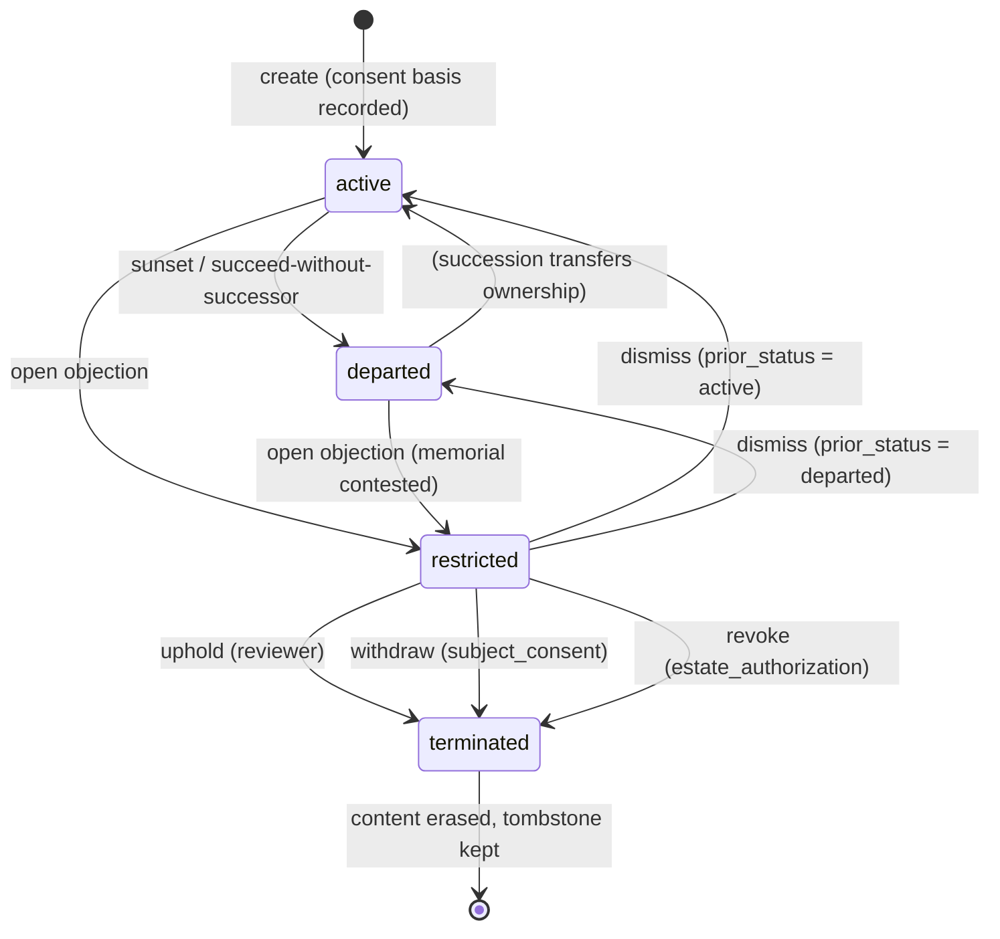

# Third-party objection & revocation

When a profile represents a **real person**, that person — or their estate — can
contest it. This document is the complete state machine: the endpoints, the
profile-status transitions, the PDI-sealed audit trail, and how it all interacts
with the memorial and succession lifecycle.

Backend: [`qrme/routers/governance.py`](../qrme/routers/governance.py).
Tests: [`tests/test_objections.py`](../tests/test_objections.py),
[`tests/test_objection_revocation.py`](../tests/test_objection_revocation.py).

## Profile status state machine



* **restricted** — public surfaces off, discovery hidden, no *new* interactors
  (existing relationships continue). The status the profile held before the
  objection (`active` or `departed`) is saved as `prior_status` so a dismissal
  restores it exactly.
* **terminated** — content erased, PDI-vaulted source material deleted, tokens
  revoked, any named successor cleared. The row survives as a tombstone so the
  handle/beacon can't be re-summoned and the objection record stays anchored.

## Endpoints

| Method & path | Who | Effect |
| --- | --- | --- |
| `POST /objections` | anyone (out-of-band proof) | open → profile **restricted** |
| `GET /objections/{id}` | anyone | public status check |
| `GET /objections/{id}/audit` | owner or reviewer | the sealed lifecycle timeline |
| `GET /profiles/{id}/objections` | owner | list this profile's objections |
| `POST /profiles/{id}/objections/{oid}/attest` | owner | re-attest the rights basis |
| `POST /objections/{id}/resolve` `{outcome}` | reviewer | **uphold** → terminated · **dismiss** → prior status |
| `POST /objections/{id}/withdraw` | subject | `subject_consent` only → terminated |
| `POST /objections/{id}/revoke` | subject / estate | `subject_consent` or `estate_authorization` → terminated |

### Which teardown applies to which consent basis

| Consent basis | Unilateral teardown | Path |
| --- | --- | --- |
| `subject_consent` | yes — the subject withdraws | `/withdraw` or `/revoke` |
| `estate_authorization` | yes — the estate revokes | `/revoke` |
| `public_figure_commentary` | **no** — commentary is not consent-based | review only (`/resolve`) |

## Audit trail (PDI-sealed)

Every transition is appended to the local `objection_events` table **and**, when
a PDI vault is configured, sealed into it under
`qrme/governance/{profile_id}/{objection_id}/{event_id}`. Because PDI
hash-chains every write, the sealed copy is independently tamper-evident — the
platform can't quietly rewrite history. Events: `opened · reattested · upheld ·
dismissed · withdrawn · revoked · terminated`, each with the acting party
(`objector · owner · reviewer · subject · estate · system`). Sealing never
blocks the action: if the vault is unreachable the event is still recorded
locally and flagged `sealed: false`.

```
GET /objections/obj_ab12/audit
{
  "objection_id": "obj_ab12",
  "profile_id": "prof_…",
  "status": "upheld",
  "vault_backed": true,
  "events": [
    {"event": "opened",     "actor": "objector", "sealed": true, "at": "…"},
    {"event": "upheld",     "actor": "reviewer", "sealed": true, "at": "…"},
    {"event": "terminated", "actor": "system",   "sealed": true, "at": "…"}
  ]
}
```

## Memorial & succession interactions

* **A memorial can be contested.** Opening an objection against a `departed`
  profile suspends the memorial (`restricted`, so `GET …/memorial` returns 409).
  A **dismissal restores the memorial** (`prior_status = departed`); an
  **uphold / withdraw / revoke tears it down** (`terminated`, anchors removed).
* **Succession is blocked while contested.** `POST /profiles/{id}/succeed`
  returns 409 if an objection is open — a contested identity can't be handed to
  a new owner until it's resolved. Termination also clears `successor_owner`, so
  a torn-down profile can never be revived through succession.

## Before / after screen flow

**Before** — the owner opens the app to a normal, active profile:

```
Overview ─ "Profile live"  ▸ chat / compose / posts all available
```

**After an objection is opened** — the same profile, now contested:

```
Overview ─ "⚠ Restricted · under objection"
   └▸ Objection & Revocation screen
        Objection obj_ab12   status: OPEN     basis: subject_consent
        Timeline (vault-sealed ✓)
          • opened      — objector
        Actions:  [ Re-attest my basis ]        ← owner
        (reviewer, elsewhere:  Uphold │ Dismiss)
        (subject/estate:       Withdraw │ Revoke → immediate teardown)
```

**After resolution:**

* **dismiss** → back to *"Profile live"* (or *"Memorial"* if it was departed)
* **uphold / withdraw / revoke** → *"Terminated"* tombstone; content gone, the
  audit trail remains for the record.

The mobile mock of the contested state is screen **55 — Objection & Revocation**
in [`docs/screens`](screens/).
