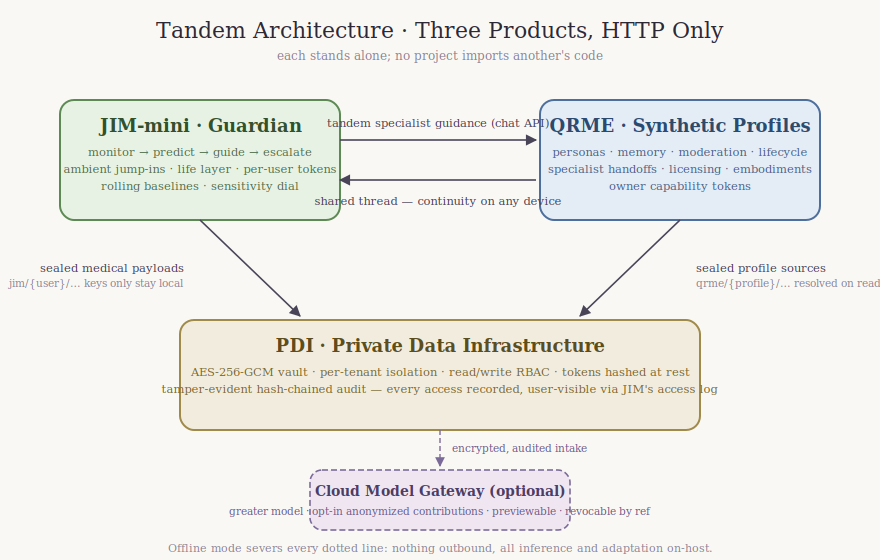

# Tandem architecture



Three separate products in three separate repositories — each stands alone
and can also **interoperate over HTTP**. No project imports another's code.

- [`qrme`](https://github.com/davidsbianchi1984/qrme) — AI synthetic-profile
  platform (relationship-aware profiles, memory, moderation)
- [`jim-mini`](https://github.com/davidsbianchi1984/jim-mini) — Guardian
  personal-guidance system (monitor → predict → guide → escalate, life layer)
- [`pdi`](https://github.com/davidsbianchi1984/pdi) — Private Data
  Infrastructure (encrypted vault, tenant isolation, tamper-evident audit)

```
   ┌──────────────────┐        HTTP         ┌─────────────────────────┐
   │  jim-mini /      │ ─ ─ optional ─ ─ ─▶ │  qrme                   │
   │  Guardian        │  tandem specialist  │  synthetic profiles     │
   │                  │  guidance           │                         │
   └──────────────────┘                     └─────────────────────────┘
           │                                          │
           │ optional (medical &                      │ optional (profile
           │ context payloads)                        │ source material)
           ▼                                          ▼
   ┌──────────────────────────────────────────────────────────┐
   │  pdi — Private Data Infrastructure                       │
   │  AES-256-GCM vault · per-tenant isolation · audit chain  │
   └──────────────────────────────────────────────────────────┘
```

## qrme ✕ jim-mini

JIM-mini is a standalone personal-guidance system: it monitors a user's
biometric and contextual signals, detects known conditions, delivers guidance,
and escalates on critical events. It runs entirely on its own using its own
guidance engine.

When a **tandem specialist** is registered for a condition and JIM is
configured with a QRME endpoint (`JIM_QRME_URL`), JIM delegates guidance for
that condition to a QRME specialist synthetic profile — reached only through
`jim/qrme_client.py` over QRME's public HTTP API. The QRME reply passes QRME's
own persona conditioning, moderation, and per-user memory before JIM surfaces
it. Without the endpoint, JIM uses its own standalone guidance — the two
remain independent.

## qrme / jim-mini ✕ pdi

PDI is a separate secure-hosting product: a private, encrypted data vault with
a tamper-evident audit log and a tenant registry, modeling the "Private Data
Infrastructure" proposal (on-premises or colocation deployment, optional
AI-system integration).

Each AI system can *optionally* run on top of PDI as a tenant, each with its
own client and token — both integrations are live:

- **jim-mini** (`jim/pdi_client.py`, `JIM_PDI_URL` + `JIM_PDI_TOKEN`): medical
  payloads — biometric samples, detection details, forecast trends, check-in
  notes — and consented context payloads are sealed under `jim/{user}/…`
  keys; JIM's own database keeps only key references, prediction reads prior
  samples back from the vault, and `DELETE /data/{user_id}` purges the vault.
- **qrme** (`qrme/pdi_client.py`, `QRME_PDI_URL` + `QRME_PDI_TOKEN`): profile
  source material — life stories, writings, conversations, voice transcripts —
  is sealed under `qrme/{profile}/sources/…` keys, resolved on read for
  persona prompts and exports, and purged when the profile is deleted.

The AI systems do not depend on PDI to function; PDI is the "run on top of"
infrastructure layer they integrate with when deployed in a private
environment. Every vault access lands in PDI's hash-chained audit log, and
`GET /audit/verify` detects any retroactive edit.

## Why over HTTP, not imports

Each product is independently deployable, versioned, and separately repo'd.
Interoperation only through public HTTP APIs keeps the boundaries honest: any
project can be run, tested, and shipped without the others present.

## Cross-cutting design (identity, deletion, billing, compliance)

The three products interoperate but stay independently deployable. This
section specifies the cross-cutting concerns. **[implemented]** = in code;
**[planned]** = intended design.

### Unified identity & account linking **[planned]**

Today each system has its own principals: QRME `interactor`/`owner`, JIM
`user`, PDI `tenant`. There is deliberately **no shared user table** — that
keeps the boundaries honest and each product runnable alone.

The planned account-linking layer is opt-in and reference-based, not a shared
database:

- A thin **identity broker** (OIDC) issues a stable `subject` id. Each app
  stores that `subject` against its own principal (a nullable
  `linked_subject` column) — so a person is *recognized* across apps without
  any app owning the others' data.
- Linking is explicit: the user authorizes app B to associate its principal
  with the same `subject` as app A. Unlinking is always available.
- The tandem clients already pass no personal identity across the HTTP
  boundary (JIM→QRME uses an opaque interactor id it created; QRME→PDI uses a
  tenant token) — the broker sits *above* this and never widens what crosses
  the wire.

### Data-deletion propagation **[implemented]**

Within each app, deletion is complete today: QRME `DELETE /profiles/{id}` and
JIM `DELETE /data/{user_id}` erase every local table **and** purge that
principal's PDI vault records via tracked keys. **[implemented]**

Cross-app propagation runs through the **suite gateway** (`suite/gateway.py`):
`POST /suite/erase` fans the right-to-be-forgotten out to every product the
identity holds — deleting the profile in QRME, erasing the user in JIM, and
dropping every sealed record in the PDI tenant — using the per-product tokens
the caller already holds (the gateway stays stateless, storing no credential
of its own). It returns a **per-product receipt** so a partial failure is
visible rather than silently swallowed, and `complete` is true only when every
product acknowledged. **[implemented]**

Each product erases with its *own* authority: QRME/JIM with the owner/user
token, PDI via the tenant's own write token — no admin key needed. PDI never
initiates deletion — it is the storage layer; the owning app (or the gateway on
the tenant's behalf) always drives the purge, so there is no orphaned
ciphertext.

### Billing / subscription **[implemented: metering hooks]**

A single subscription spans the three products, metered per product. The suite
gateway exposes `POST /suite/usage`, which aggregates a cheap counter from each
product into one meter (`suite-usage/v1`) a downstream biller reads against the
linked identity:

- QRME: profile stats (interactions, relationships, sources).
- JIM-mini: recorded events.
- PDI: sealed record count (ciphertext bytes / ops/day are also derivable from
  the audit chain — see PDI `docs/operations.md`).

Metering hooks are implemented; actual rating/charging and entitlement tiers
(which unlock adult mode, cloud model, knowledge packs) live in the billing
system outside the three repos and are checked at the app boundary. **[rating
out of v1]**

### Exact tandem data flows & error handling **[implemented]**

**JIM → QRME specialist handoff** (guidance delegation):
1. A condition is detected for a JIM user with a `tandem` specialist
   registered (`qrme_profile_id`).
2. JIM lazily creates a QRME interactor for the user (once, tracked in
   `tandem_links`) via `POST /interactors`.
3. JIM calls `POST /profiles/{qrme_profile_id}/chat` with a `[Guardian
   monitoring]` framed message describing the condition.
4. QRME conditions the reply on the specialist persona, runs it through
   **QRME's own moderation**, stores it in per-user memory, and returns
   `{content, status, flag_reason}`.
5. JIM surfaces `content` when `status=approved`; a `pending` (held) reply is
   reported to the user as awaiting approval, not shown.
- **Fallback**: if a tandem specialist is registered but no QRME endpoint is
  configured, JIM falls back to its own standalone guidance and says so — the
  user is never left without help.

**App → PDI vault** (sealed storage):
1. The app seals a payload under a namespaced key (`jim/{user}/…`,
   `qrme/{profile}/…`) via `PUT /records`; only the key reference stays local.
2. Reads resolve the key back through `GET /records/{key}`; a missing key
   returns None and the app degrades gracefully.
- **Fallback / offline**: PDI is optional — with no PDI configured, both apps
  store data locally exactly as before. A PDI outage mid-operation surfaces as
  a storage error the app handles; detection/insight rules run on the payload
  in memory *before* sealing, so behavior is identical whether or not the seal
  succeeds.

### Consent management **[implemented]**

Consent lives with the app that collects it today: QRME captures profile
verification, third-party rights basis, and `cloud_contribution`; JIM captures
terms/guardian consent, emergency-contact consent, per-source consent,
`provider_consent`, and `cloud_contribution`. **[implemented]**

A **unified consent center** is backed by the suite gateway:
`PUT /suite/consent` seals one authoritative consent document in the identity's
PDI vault (encrypted at rest, recorded on the tamper-evident audit chain, so
every change is regulator-exportable), and `POST /suite/consent/read` reads it
back. Consent is **enforced, not just logged** — withdrawing
`cloud_contribution` also calls QRME's `cloud-contribution/revoke`, so the
toggle takes effect across products. **[implemented]**

### Security & compliance **[implemented foundations + planned]**

- **Encryption at rest**: AES-256-GCM in PDI, AAD-bound per tenant+key.
  **[implemented]**
- **Audit**: PDI's tamper-evident hash chain records every data access;
  `GET /audit/verify` proves integrity. **[implemented]**
- **Access control** **[implemented]**: every app authenticates with bearer
  capability tokens stored only as SHA-256 hashes (a database leak yields no
  usable credential):
  - **QRME** — per-profile *owner* tokens gate all owner control (edit,
    sources, memory, moderation, export, erasure, workflows, licensing);
    *interactor* tokens gate private memory; a *reviewer* role
    (`QRME_ADMIN_TOKEN`, constant-time compare) adjudicates objections and
    succession. Public surfaces (chat, marketplace, summon) stay open by
    design.
  - **JIM-mini** — per-user tokens minted at `/enroll` gate every
    `/{user_id}` surface (all of it is PHI); erasure revokes the token.
  - **PDI** — tenant tokens (hashed at rest) with read/write RBAC;
    `PDI_ADMIN_TOKEN` (constant-time compare) guards the admin plane.
- **User-visible audit**: JIM's `GET /access-log/{user}` shows a user every
  access to their own sealed records — filtered to their namespace,
  verifiable against the chain. **[implemented]**
- **GDPR**: right-to-erasure = suite-wide `POST /suite/erase` with a
  per-product deletion receipt; data-portability = `POST /suite/export`, one
  `suite-export/v1` bundle carrying every product's export (QRME profile export,
  JIM progress report, PDI ciphertext snapshot). **[implemented]**
- **HIPAA** (JIM medical data): PHI is sealed in PDI, access is audited and
  user-visible (the access log above), and provider handoff is consent-gated
  and revocable — the technical safeguards are in place; a production
  deployment adds a BAA with the KMS/hosting provider. **[planned: formal
  BAA]**
- **Regulator audit export** **[planned]**: `GET /audit/export` (admin,
  per-tenant) produces a signed, verifiable slice of the audit chain.

### Testing strategy for the tandem stack **[implemented]**

- Each repo's suite runs standalone with an offline stub provider and no
  external services (QRME 59, JIM 49, PDI 20 tests).
- Cross-service boundaries are exercised with doubles at the HTTP-client seam
  (JIM's `FakeQRME`, QRME/JIM's `FakePDIHttp`, the `FakeCloudHttp` gateway) —
  so tandem logic is covered without standing up the other services.
- A verified end-to-end run wires the **real** apps in-process (JIM ✕ real
  QRME, JIM/QRME ✕ real PDI) to confirm the seams: sealed medical payloads
  resolve, the audit chain stays intact, and erasure empties the vault.
- **[planned]**: a `docker compose` harness that boots all three and runs a
  full-stack end-to-end flow (enroll → monitor → detect → QRME specialist →
  vault → handoff → erase) as CI.
